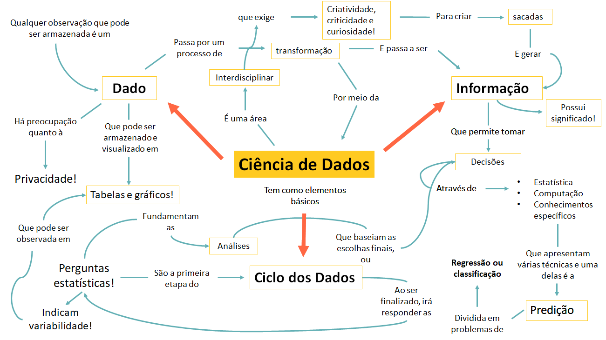

# Introdução à Ciência de Dados {#cap1}

Provavelmente você deve estar pensando que não faz ideia do que seja Ciência de Dados, já que nunca teve contato com esta área da ciência. Mas, será mesmo? Ao longo deste capítulo vamos entender o que é a **Ciência de Dados** e refletir como ela está inserida no nosso dia a dia. 

_A Ciência de Dados pode ser definida como o campo do conhecimento que busca transformar **dados** em **informações**._
  
_Mas, o que isto significa?_

Observe a Figura \@ref(fig:figura11) que trata algumas situações vivenciadas na nossa cidade ou comunidade, que precisam ser adaptadas para melhorar o bem estar dos cidadãos. Você consegue imaginar como a Ciência de Dados poderia ajudar a lidar com estas dificuldades? Verifique os setores observados, os questionamentos e possíveis soluções indicados nas caixas em azul.

```{r figura11, echo=FALSE, fig.cap="Ciência de Dados para o bem social", align = "center", out.width = '100%', fig.align='center'}
knitr::include_graphics("fig_cap1/fig1_cap1.png")
```

Esta imagem é um bom referencial de algumas aplicações da Ciência de Dados para o bem da sociedade. Além disso, mostra como podemos partir de problemas e perguntas iniciais para realizar investigações. Observe o questionamento 1, em que os ônibus não passam no horário esperado. Uma das formas de solucionar este problema é através de uma estimativa da frequência ideal de ônibus neste ponto, com base em um tempo de espera que se imagina ser adequado. Então, para definir esta frequência é necessário saber: 

* a **frequência dos ônibus** que ali passam para conhecer a situação atual
* a **quantidade de passageiros** que utiliza o transporte
* a **melhor rota** que deve ser percorrida, de forma que evite atrasos no translado

A definição destes tópicos é importante, pois eles indicam quais dados são necessários obter. A partir do momento que são obtidos, o processo investigativo evolui até que se saiba qual é a frequência ideal de ônibus neste ponto da cidade!  

Observe como temos questionamentos em tantas áreas diferentes. Isto indica que a Ciência de Dados é um campo do conhecimento que nos permite abordar problemas de uma forma abrangente e com aplicações em diversos setores! 

No processo da Ciência de Dados, o **dado** é transformado em informação relevante por meio de etapas que permitem analisar tendências e prever comportamentos futuros! Estas informações geradas permitem extrair conclusões e criar **sacadas** (os famosos _**insights**_ ou "lampejos de ideias") para responder a perguntas e solucionar problemas.

> _Que tal conhecer alguns setores que tem aplicado Ciência de Dados aqui no Brasil?_
> Transportes e Mobilidade Urbana: [link 1](https://jornal.usp.br/ciencias/ciencias-humanas/dados-sobre-onibus-em-sp-permitirao-analises-criticas-do-servico/) [link 2](https://www.caf.com/pt/presente/noticias/2019/03/ciencia-dados-para-aprimorar-as-politicas-publicas-a-experiencia-de-cordoba/)  
> Saúde: [link](https://www.einstein.br/Pages/Home.aspx)  
> Segurança pública: [link](https://jornal.usp.br/universidade/acoes-para-comunidade/pesquisadores-aplicam-ciencia-de-dados-e-inteligencia-artificial-no-combate-ao-crime/)  
> Comunicação  com clientes: [link](https://g1.globo.com/jornal-nacional/noticia/2019/03/09/ligacoes-de-robos-incomodam-muitos-brasileiros.ghtml)  
> Turismo: [link](https://datascienceacademy.com.br/blog/7-casos-de-uso-de-data-science-no-turismo/)  
> Atividade Jurídica: [link](http://www.crb8.org.br/entrevista-sofia-marshallowitz-ciencia-de-dados-aplicada-ao-direito/)

Para aplicar esta ciência é preciso ter conhecimentos de Estatística, Computação e conhecimento sobre o problema investigado! Isto porque as ferramentas de solução são baseadas nestes conteúdos, por isso eles são a essência da Ciência de Dados! Mas não se engane, estas ferramentas "matemáticas" são vinculadas à ciências sociais, biológicas, ambientais, ao setor de negócios, tecnologia, entre outros, a fim de descobrir padrões em problemas de diferentes naturezas (como vimos na Figura \@ref(fig:figura11)). Por este motivo, a Ciência de Dados é uma área **interdisciplinar**. A Figura \@ref(fig:figura12) esquematiza os conteúdos básicos da Ciência de Dados.

```{r figura12, echo=FALSE, fig.cap="Interdisciplinaridade da Ciência de Dados", align = "center", out.width = '60%', fig.align='center'}
knitr::include_graphics("fig_cap1/fig2_cap1.png")
```

_Mas por quê a Ciência de Dados se tornou indispensável?_  
A popularidade da área veio a partir do aumento de dados disponíveis atualmente. É impossível gerir tantos dados sem a utilização de computadores, que apresentam alta capacidade de processamento. Mas atenção, embora a Ciência de Dados seja favorecida pela tecnologia, é importante ressaltar que são seres humanos que direcionam, criam regras, avaliam e manuseiam todo o processo investigativo. Portanto, a criticidade de um profissional que avalie a execução de cada etapa realizada é essencial para garantir análises e interpretações coerentes a cada situação.

_Para compreender melhor como o processo de Ciência de Dados ocorre, vamos pensar na seguinte situação:_   
Sabemos que atualmente o lazer está muito vinculado ao uso de tecnologias e, portanto, estamos a um clique de uma música que gostamos de ouvir, ou de um vídeo que queremos assistir, uma busca no _google_ sobre algum tema de interesse. O fato de realizarmos estas buscas revela nossos interesses, você concorda? A partir da análise do nosso histórico de buscas, várias propagandas ou recomendações podem começar a nos ser feitas. Pense em quantas vezes você pesquisou sobre algum item e depois surgiram várias propagandas sobre ele. Ou quando você assistiu no _youtube_ o clipe de uma banda e depois apareceram sugestões de outros clipes desta mesma banda, como na Figura \@ref(fig:figura13). Observe que nesta imagem estamos assistindo a um vídeo da banda _Coldplay_, e ao lado existem várias sugestões de outras músicas deles, inclusive há uma indicação de outra banda. 

```{r figura13, echo=FALSE, fig.cap="Mecanismo de recomendação do Youtube", align = "center", out.width = '80%', fig.align='center'}
knitr::include_graphics("fig_cap1/fig3_cap1.png")
```

_Que tal entender melhor como este mecanismo ocorre?_  
Imagine que você será responsável por escolher um filme para assistir junto com seus amigos. Porém, eles disseram gostar de filmes de terror, romance, suspense, ação, comédia, ficção científica e drama. Para você ficou quase impossível escolher frente à tantas opções, já que quer ter certeza que eles irão curtir o filme. Assim, como podemos saber qual gênero de filmes deve ser escolhido? Sabendo isso, a sua escolha será certeira e a diversão estará garantida! 

Podemos solucionar este problema utilizando a Ciência de Dados para analisar as preferências de filme dos seus amigos, de forma similar ao mecanismo de recomendações do _youtube_, por exemplo. Nas próximas seções deste capítulo, vamos solucionar cada etapa desta investigação!

> Quer saber mais sobre onde a Ciência de Dados se aplica? Assista ao vídeo abaixo:

<div class="embed-container">
<iframe width="560" height="315" src="https://www.youtube.com/embed/WjSimFnfPF0" frameborder="0" allow="accelerometer; autoplay; encrypted-media; gyroscope; picture-in-picture" allowfullscreen></iframe>
</div>
</br>
Depois de tantos exemplos uma conclusão é real: a Ciência de Dados está por toda parte e nós, fazemos parte dela ao consumir ou gerar dados. Você concorda?

## O que são "dados" e onde estão presentes? {#cap1.1}

No item anterior vimos que a Ciência de Dados é algo indispensável, já que é impossível lidar com tantos dados sem o uso de tecnologias. Vimos também, que parte destes dados, somos nós quem geramos. Precisamos entender o que significa a palavra **dados** neste contexto. 

Vamos dar sequência no nosso exemplo, onde queremos descobrir qual é o gênero de filmes que você deve escolher. Para isto, podemos avaliar qual é o gênero favorito de cada amigo seu a partir dos filmes que eles assistiram recentemente e o gênero destes filmes. Desta forma, iremos verificar se eles têm a preferência em comum por algum gênero. Para iniciar a investigação, devemos criar um registro para cada pessoa, contendo características importantes coletadas para a avaliação das preferências deles, como: 

* Nome
* Filmes assistidos
* Gênero do filme

Portanto, o nosso registro irá conter observações de cada característica citada, para cada pessoa. Assim, dizemos que as observações destas determinadas características são os nossos dados.  

_Em outras palavras: dados são **observações** que foram coletadas e armazenadas de alguma forma. Inicialmente, compõem apenas registros e não apresentam relevância. Qualquer dado pode ser armazenado, caso contrário não pode ser considerado um dado._

>*O dado por si só não apresenta significado e por isso não serve para gerar respostas, interpretações e informações. Assim, somente após processar e transformá-los é que se torna possível tirar conclusões.*

</br>
Parte do trabalho do investigador é avaliar quais dados são de fato importantes para o processo de análise. Muitas vezes temos uma grande quantidade de dados, mas ao avaliar a natureza do problema percebemos que nem todos são fatores importantes para a situação investigada. 

No nosso exemplo, queremos saber qual gênero de filmes você deve escolher para assistir com seus amigos. Já vimos que algumas características são importantes para guiar a sua decisão final, mas podem existir outras que também complementariam nossos dados. Todavia, deve ser feita uma valiação sobre a importância delas para o problema abordado. Por exemplo, poderíamos coletar a altura e peso de cada amigo, mas, isso seria relevante para a nossa investigação? Claramente não, portanto não faria sentido registrar estes dados. Observe também que você obteve os dados por meio de uma pesquisa realizada com os seus amigos. Todavia, há muitas outras fontes de obtenção de dados. Basta lembrar que nós mesmos somos geramos dados quando interagimos em uma rede social. 

_Portanto, os dados podem ser obtidos pelo uso de celulares, computadores, sensores, registros escolares, pesquisas de opinião ou qualquer forma de registro._ 
</br>
E porquê é tão importante entendermos a definição de dados e como eles são obtidos? Basicamente, porque eles são a essência da Ciência de Dados. Sem eles não é possível gerar informações e aplicar o processo investigativo. A análise dos dados permite observar uma **tendência** ou **padrão** em processos, fenômenos na natureza ou mesmo nos nossos comportamentos. E este é o grande objetivo da Ciência de Dados, **reconhecer padrões** e **interpretá-los** para tomar boas decisões!


### Posso compartilhar dados? {#cap1.1.1}

Vamos voltar à nossa investigação sobre os filmes. Lembre-se que para nós é importante registrar os últimos filmes assistidos pelos nossos amigos, o gênero dos filmes e a identificação da pessoa. Podemos nos questionar se estes registros serão restritos à você que está analisando ou se serão abertos à qualquer pessoa (inclusive seus amigos). É um questionamento pertinente? Haveria algum incômodo se qualquer pessoa tivesse acesso a estes registros? 

Outro questionamento que poderia ser feito antes mesmo de seus amigos aceitarem participar do experimento é: como os dados serão utilizados e com qual finalidade?

Estas perguntas são importantes porque as informações adquiridas a partir dos dados revelam gostos pessoais e padrões de comportamento dos seus amigos. E, portanto, quem tiver acesso a estes dados vai ter conhecimento sobre as preferências deles. E a forma como esta informação será utilizada é extremamente importante. Assim, temos duas observações: 

*1. dados são gerados a todo momento*

*2. dados são transformados em informações que revelam padrões desconhecidos.*

Por este motivo, empresas e organizações tem tanto interesse em deter dados de usuários dos seus serviços, pois isso permite conhecer o cliente a ponto de fazer ofertas que se adequem ao perfil de cada um. Mas, quais são as consequências dessa prática? Para compreender mais, vamos discutir sobre a **privacidade**.

### Privacidade de dados {#cap1.1.2}

A privacidade antes de tudo é um direito. Este direito nos resguarda da exposição de nossas informações pessoais. O contexto atual de estarmos conectados, com uma constante troca de informação, traz algumas preocupações quanto à garantia da nossa privacidade. 

Podemos começar citando o exemplo das publicações em redes sociais. Por meio delas, divulgamos sobre nosso local de trabalho ou estudo, quem são nossos familiares, nosso itinerário, datas importantes e tantas outras informações, na maioria das vezes sem refletir o que isto representa. E estes são os dados que nós sabemos que estamos divulgando!

Além disso, os aplicativos que temos em nossos *smartphones* podem ter acesso à nossa câmera, microfone e contatos. Sim, ao fazer o download de um aplicativo e concordarmos com os termos de condição de uso, damos acesso à todos estes dados. Você já leu os termos de condições antes de prosseguir com a instalação de um aplicativo?   

Mas muito além do que publicamos, existe uma infinidade de dados que são coletados sobre nós que nem temos ideia. Eles alimentam grandes *bases de dados* de empresas, organizações ou instituições. Nossas preferências de lazer, política, estilo, gostos musicais, itens que compramos, informações bancárias, local de viagens, são convertidos em informações nas mãos de quem pode manipulá-los. Ficamos expostos, sendo influenciados por serviços e propagandas e, ao mesmo tempo, não temos acesso à forma que processam estes dados. 

Assim, sempre que abrimos nossos aplicativos, automaticamente somos direcionados a interagir com posts de conteúdos preparados para prender a nossa atenção, ou sempre existem propostas imperdíveis para adquirir itens que geralmente nos interessamos. 

O ponto central que deve ser levantado aqui é que podemos sim fazer uso de aplicativos, redes sociais e sites, mas devemos ter criticidade para entender que somos monitorados e possivelmente influenciados. Para refletir mais sobre a privacidade dos dados, assista ao vídeo indicado.

<div class="embed-container">
<iframe width="560" height="315" src="https://www.youtube.com/embed/qw_TGrpPdkw" frameborder="0" allow="accelerometer; autoplay; encrypted-media; gyroscope; picture-in-picture" allowfullscreen></iframe>
</div>
<br />

>_Já ouviu o termo **LGPD**?_ <br />
Diante da problemática da privacidade e segurança dos dados, o Brasil aprovou a _Lei n° 13.709/18 (Lei de Proteção de Dados - LGPD)_, o que vai exigir a adequação de empresas e corporações que realizam coleta, tratamento, processamento ou comércio de dados em prol de grantir a privacidade e a segurança de usuários. Isso será feito por meio de políticas e planos de proteção de dados. Ao mesmo tempo, nós usuários deveremos estar mais atentos à segurança que as empresas oferecem aos nossos dados. *(Para saber mais sobre esta lei, assista ao [vídeo](https://www.youtube.com/watch?v=fuuudzh1qEo))*  
A rede social Facebook é um exemplo de organização que já iniciou as alterações recomendadas pela lei em busca de transparência. A Figura \@ref(fig:figura14) exibe partes da mensagem que aparece ao realizar o acesso à página. 


```{r figura14, echo=FALSE, fig.cap="Notificação do Facebook", align = "center", out.width = '100%', fig.align='center'}

```


## O ciclo dos Dados - Construindo uma pergunta estatística {#cap1.2}

No início do capítulo, definimos Ciência de Dados como um campo da ciência que realiza a transformação de dados em informação por meio de etapas. Neste tópico, vamos compreender melhor sobre cada etapa que ocorre neste processo. Primeiramente, esta série de etapas é denominada como *Ciclo dos dados*. 

A compreensão do ciclo dos dados dá uma noção geral sobre o que deverá ser realizado na metodologia de investigação, possibilitando um melhor planejamento de cada etapa.

Uma vez que a Ciência de Dados busca extrair padrões para lidar com problemas, é essencial que inicialmente se tenha uma pergunta a ser respondida. Esta pergunta irá direcionar todo o nosso processo em relação à quais dados devem ser coletados, quais são os melhores métodos de análise e qual a natureza do problema.

O Ciclo dos Dados compreende quatro etapas, como indicado na Figura \@ref(fig:figura15):

```{r figura15, echo=FALSE, fig.cap="Etapas do ciclo de Dados", out.width = '80%', fig.align='center'}
knitr::include_graphics("fig_cap1/fig5_cap1.png")
```

Vamos lembrar do nosso exemplo inicial, cuja pergunta é: Qual gênero de filme você deve escolher para assistir com seus amigos com base nas preferências deles?

Observe que geramos uma pergunta inicial que só poderá ser respondida a partir dos dados. Isto significa dizer que precisaremos coletar dados, analisá-los e, por fim, interpretá-los para tomar uma decisão. Por este motivo, esta pergunta é definida como **pergunta estatística**. A partir dela todas as outras etapas do ciclo dos dados serão direcionadas, a fim de respondê-la. A Figura \@ref(fig:figura16) indica como cada etapa se desenvolve.

```{r figura16, echo=FALSE, fig.cap="O que fazer em cada etapa?", align = "center", out.width = '80%', fig.align='center'}
knitr::include_graphics("fig_cap1/fig6_cap1.png")
```

Mas, como saber se temos uma pergunta estatística ou não? Lembre-se que uma pergunta estatística deve atender os requisitos citados no parágrafo anterior. Portanto, se eu te perguntasse: "Qual a sua idade?", esta seria uma questão estatística? 

Bom, você me responderia a sua idade. Porém, não seria necessário coletar mais dados para responder a pergunta, pois apenas uma única observação já foi suficiente. Ou seja, a etapa de análise de dados não se faz necessária e por isso, não chegamos à etapa de interpretação dos dados. Por estes motivos, comprovamos que esta questão não é uma pergunta estatística, pois não indica variabilidade. 

_Uma **pergunta estatística** sinaliza a **variabilidade** dos dados, que acontece quando existem observações que diferem da maioria registrada._
</br>
Podemos adaptar a pergunta para que ela se torne uma questão estatística! No caso, poderíamos perguntar: "Qual é a idade dos estudantes do Projeto Ciência de Dados na Educação Pública?". Ao coletar a idade de cada estudante perceberíamos que muitas se repetem, mas também há algumas que variam. Por exemplo, observamos estudantes de 11 a 15 anos. Todas as observações coletadas poderiam tranquilamente ser dispostas em um gráfico ou tabela que seriam usados para mostrar o padrão de idades da turma de estudantes do projeto. Graficamente, notamos que a maioria das idades equivale a 14 anos! Assim, todas as etapas do ciclo de dados se cumprem para responder esta pergunta. 

Veja a Figura \@ref(fig:figura17) que aponta diferenças entre estes dois tipos de perguntas. 

```{r figura17, echo=FALSE, fig.cap="Pergunta estatística e não estatística", align = "center", out.width = '100%', fig.align='center'}

```

Outro conceito relevante para qualquer investigação, é que para responder a uma pergunta estatística, podemos estabelecer **hipóteses**, que pode ser considerada como uma suposição que será testada ao longo do processo. Esta hipótese pode estar correta, neste caso ajudando a solucionar o problema, ou pode estar incorreta. Neste caso, precisamos investigar os motivos pelos quais ela é incorreta, e pode até indicar que a nossa pergunta precisa ser melhorada. Pense no caso do nosso exemplo dos filmes, poderíamos estabelecer uma hipótese onde arriscamos dizer qual será o gênero preferido. Bom, esta hipótese será testada ao longo da investigação, e ao final, poderemos dizer se estava certa ou não. 


## Estruturando os dados {#cap1.3}

Após definir a pergunta estatística, devemos coletar os dados e armazená-los em algum formato. Chamamos de **estrutura de dados** o formato em que estes dados ficam armazenados. 

A tabela é uma forma muito comum de se estruturar dados, embora não seja a única. Este formato é comum pois os dados ficam dispostos de uma forma organizada e de fácil entendimento. 

A tabela é composta por linhas e colunas. Veja como exemplo a Tabela 1:

Nome | Filme assistido | Gênero | 
:-----:|:---:|:---:|:----:|
Gabrielle | Entre Realidades | Drama
Gabrielle | Getúlio | Drama
Gabrielle | Até que a sorte nos separe | Comédia
Gabrielle | Terremoto: A falha de _San Andreas_ | Ação 
Karen | A Lista de Schindler | Drama
Karen | Férias Frustradas | Comédia
Karen | Letra e Música | Romance
Karen | Pantera Negra | Ação
Isaac | Madagascar | Comédia
Isaac| Karatê Kid | Ação
Isaac | Um senhor estagiário | Comédia
Isaac | A mulher de preto | Terror

Observe que as colunas trazem as características dos dados que coletamos. Já as linhas trazem as observações coletadas para cada pessoa, a respeito das características. Perceba que para uma mesma característica temos observações que podem ser iguais ou diferentes. Embora um mesmo **Gênero** possa aparecer repetidas vezes, notamos que há observações que diferem. Por isso a tabela também permite enxergar a variabilidade dos dados. No capítulo \@ref(cap2) este tópico será abordado de forma mais aprofundada.

>Além de representar os dados por meio de tabelas, você aprenderá no capítulo \@ref(cap3) como representar os dados de forma gráfica. Este formato permite visualizar as informações de uma forma mais clara e mais explicativa.

## Identificando o tipo de problema {#cap1.4}

Um grande diferencial da Ciência de Dados é a investigação sobre o que os dados revelam acerca do futuro. Portanto, esta ciência não só obtém diagnósticos sobre situações já ocorridas como também traz _insights_  sobre o que pode acontecer (Lembra deste termo? São aquelas **sacadas** que comentamos no início do capítulo). A isto chamamos de **predição**.  
Parte do trabalho da Ciência de Dados é realizar predições, e para isto, existem métodos estatísticos que podem ser aplicados. Em geral, podemos dividir as situações em problemas de **Regressão** ou **Classificação**. A Figura \@ref(fig:figura18) exemplifica estes métodos.

</br>
```{r figura18, echo=FALSE, fig.cap="Regressão x Classificação", align = "center", out.width = '100%', fig.align='center'}
knitr::include_graphics("fig_cap1/fig8_cap1.png")
```

Você irá aprender detalhadamente como aplicar estes métodos nos capítulos  \@ref(cap9) e  \@ref(cap10) deste *e-book*. 

## Considerações finais {#cap1.5}

Neste capítulo você foi apresentado à área de Ciência de Dados e percebeu como ela está presente no nosso dia a dia. Outro ponto relevante foi a percepção da nossa atividade enquanto consumidores e geradores de dados. Esta nova forma de gerar informações exige um conhecimento mínimo sobre como podemos ser influenciados a todo tempo.


*Vamos finalizar o nosso exemplo?*  
Na tabela que constrímos, temos 4 observações para cada pessoa. Ao analisarmos quantas vezes cada gênero aparece, temos: 

* Drama: 3 observações
* Comédia: 4 observações
* Ação: 3 observações
* Romance: 1 observação
* Terror: 1 observação

Ao analisar o grupo de observações percebemos que o gênero **Comédia** aparece mais vezes no nosso conjunto de dados. Ao verificar a tabela, é possível notar que ele aparece pelo menos uma vez para cada pessoa. Portanto, é uma preferência comum a todo o grupo. Por isso, se você escolher um filme deste gênero sua chance de acerto será alta, concorda? 

A Figura \@ref(fig:figura19) sintetiza os conceitos discutidos neste capítulo introdutório.

```{r figura19, echo=FALSE, fig.cap="Esquema de conceitos", align = "center", out.width = '100%', fig.align='center'}

```

Viu quantos conteúdos novos você aprendeu neste capítulo? Este aprendizado vai se aprofundar mais à medida que você avançar no estudo deste _e-book_ e tiver curiosidade em relação aos assuntos abordados! A Ciência de Dados tem revolucionado os setores onde é aplicada, pois busca constantemente obter respostas valiosas. Portanto, o cientista de dados é movido pela curiosidade! 

## Referências {-} 

Tecmundo (2018). Do futebol à medicina: a ciência de dados está em todo lugar. Disponível em: https://youtu.be/WjSimFnfPF0.

Provocações Filosóficas (2018). A privacidade na internet. Diponível em: https://youtu.be/qw_TGrpPdkw. 

Figura \@ref(fig:figura11): Pingado sociedade ilustrativa (2010). Adaptada de: Cidade Sustentável. Disponível em: http://www.pingado.com/imagem/0811cidade_gra.jpg.

Figura \@ref(fig:figura12): Coldplay (2011). Adaptada de: Coldplay - Viva la Vida (Live in Madrid 2011). Disponível em: https://youtu.be/9ldOuVuas1c.

LGPD Brasil. Lei Geral de Proteção de Dados - Lei n° 13.709/18. Disponível em: https://www.lgpdbrasil.com.br/.

Brasil. LEI Nº 13.709, DE 14 DE AGOSTO DE 2018. Lei Geral de Proteção de Dados Pessoais (LGPD). Disponível em: http://www.planalto.gov.br/ccivil_03/_ato2015-2018/2018/lei/L13709.html. 

McAfee (2019). Desafios Tecnológicos para atender a LGPD. Disponível em: https://youtu.be/fuuudzh1qEo.

Figura \@ref(fig:figura15): O Ciclo de Dados. Adaptada de: Introduction to Data Science v_5.0 (IDS). Lesson 4: The Data Cycle. The Data Cycle file (LMR_1.3_Data Cycle)
