# Vizualização e Ciência de Dados {#cap3}


O capítulo  \@ref(cap2) apresenta a tabela como uma forma poderosa para estruturar e visualizar informações. No entanto, quando trabalhamos com enormes tabelas com uma imensa quantidade de linhas e colunas se torna difícil interpretar suas informações, não importa o quão organizadas elas estejam. Às vezes, é muito mais fácil interpretar essas informações através dos gráficos, conteúdo que será explorado no decorrer deste capítulo.

A construção e visualização gráfica é de extrema importância na área de ciência de dados, pois é a partir de um bom gráfico que podemos extrair ideias, hipóteses e um melhor entendimento a respeito de um tema ou uma pergunta. A importância desse tipo de análise pode ser expressa por um ditado popular bastante conhecido: "Uma imagem vale mais que mil palavras".

## Objeto de estudo {#objeto-estudo}

Para compreender a importância da análise gráfica e como utiliza-la corretamente, iremos buscar entender o perfil dos estudantes de Salvador que realizaram a prova do Exame Nacional do Ensino Médio (ENEM) no período de 2015 até 2019. Porém, antes de qualquer coisa: O que é um **Perfil**? Esse termo é muito usado na ciência de dados para **descrever um determinado processo ou objeto de estudo através de padrões e características que o representam**. Para este caso em específico, vamos analisar os estudantes da cidade de Salvador utilizando os microdados do ENEM, publicados pelo Instituto Nacional de Estudos e Pesquisas Educacionais Anísio Teixeira (INEP), disponível ao público através deste [link de acesso](http://inep.gov.br/microdados)^1^.

Como o termo **perfil** pode ser bem vasto e diversas características podem ser extraídas do nosso objeto de estudo, é necessário concentrar essa análise em perguntas mais específicas para nortear o caminho. No decorrer deste capítulo, serão exploradas graficamente as seguintes questões:

- A quantidade de estudantes que realizaram o ENEM aumentou de 2015 para 2019 na capital baiana?

- Como é a distribuição de estudantes em Salvador por cor/raça? Conseguimos identificar algum padrão para esses valores?

- Na dita era da informação, onde tudo está conectado, como está o acesso dos estudantes a internet em suas residências? E a computadores pessoais?

- O tipo de escola (pública ou privada) pode influenciar nas notas dos estudantes neste exame?

A compreensão desses dados é de suma importância para entender melhor o perfil dos estudantes de Salvador que possuem o ENEM como uma oportunidade de acesso, as vezes única, ao ensino superior no Brasil. No geral, diversos setores da sociedade conseguem se beneficiar destes questionamentos: Estudantes podem buscar compreender se o tipo de escola onde estudam possui algum impacto em suas notas, enquanto gestores de políticas públicas como diretores e coordenadores podem buscar compreender as três primeiras questões para compreender melhor o panorama educacional da cidade de Salvador e assim gerar embasamento para decisões importantes no aperfeiçoamento do ensino no geral.

## Gráfico de barra {#gbarras}

O **Gráfico de barras** é uma forma bastante comum e versátil de visualização na área de ciência de dados. Ele pode ser utilizado tanto com variáveis categóricas quanto numéricas para expressar grandezas. A Figura abaixo apresenta uma de suas utilizações: demonstrar grandezas numéricas.

```{r f31, fig.cap='Número de inscritos no ENEM na capital baiana', out.width='100%', fig.asp=.99, fig.align='center', echo=FALSE}

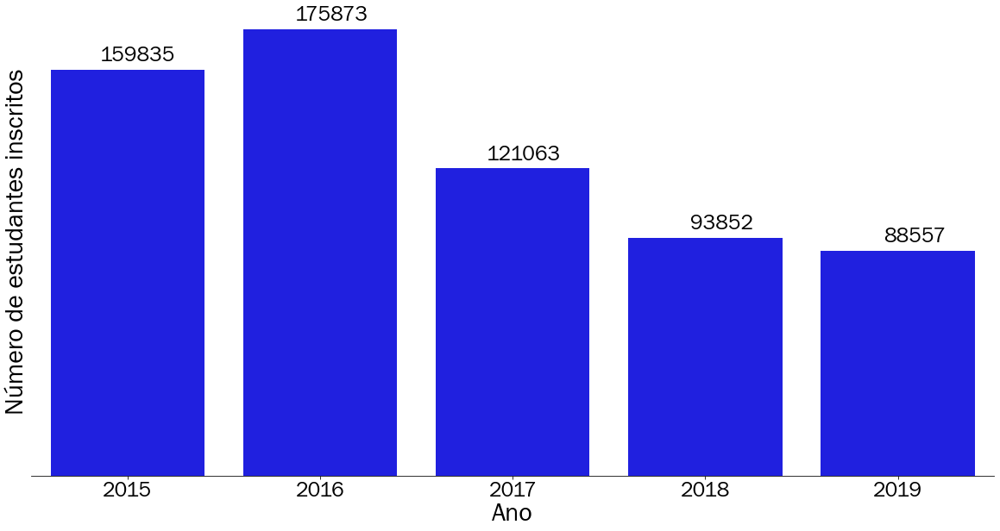

```

Na Figura \@ref(fig:f31) é apresentada a quantidade de inscritos, uma grandeza numérica, que realizaram o ENEM de 2015 até 2019 na capital baiana. É possível notar uma queda na participação dentre os períodos de 2016 até 2019. Apesar de simples e direto, a análise desse mesmo resultado através de uma tabela pode se mostrar confusa.

```{r t31, echo=FALSE, message=FALSE, warning=FALSE}
library(kableExtra);
library(dplyr);
df <- data.frame('Ano'=c(2015,2016,2017,2018,2019),
                 'Número\ total\ de\ inscritos\ em\ Salvador' = c(159835,175873,121063,93852,88557), check.names = FALSE)

kableExtra::kable(df, caption='Número total de inscritos no ENEM em Salvador de 2015 até 2019') %>% 
  kable_styling(position = "center")
```

A Tabela \@ref(tab:t31) mostra os mesmos dados apresentados na Figura \@ref(fig:f31). Note que nenhuma informação visual é passada para destacar os anos com mais ou menos participantes. Além disso, fica muito mais visível através da visualização gráfica aqueda de inscrições no ENEM de 2016 até 2019. O gráfico de barras apresenta uma característica muito importante relacionado ao tamanho das barras: elas crescem proporcionalmente de acordo as grandezas que elas se referem, ou seja, quanto maior o valor maior será sua barra. Comumente essas barras apresentam a mesma largura neste tipo de gráfico.

É através da Figura \@ref(fig:f31) que podemos responder a primeira pergunta:"**A quantidade de estudantes que realizaram o ENEM aumentou de 2015 para 2019 na capital baiana?**" E a resposta é não. Apesar do número de estudantes crescer de 2015 para 2016, observa-se uma queda do número de inscritos no ENEM de Salvador, chegando a diminuir pela metade este número de 2016 para 2019. 

Essa resposta pode levar a novos questionamentos, por exemplo, "O que realmente motivou essa queda?". Infelizmente encontrar a resposta para este questionamento não é trivial, requer pesquisas mais específicas a cerca do tema, o que foge do escopo deste capítulo. Todavia, é interessante refletir como a partir de um simples gráfico, podemos alcançar perguntas ainda mais complexas. 

Agora que respondemos a primeira questão, podemos perceber que a pergunta "**Como é a distribuição de estudantes em Salvador por cor/raça? Conseguimos identificar algum padrão para esses valores?**" está bastante relacionada ao seu resultado.
Inicialmente para entender essa relação, precisamos entender  o que seria essa distribuição de raças no questionário no ENEM. Trata-se de uma pergunta que busca entender  como o estudante se classifica em relação a sua cor. Essa pergunta possui 7 respostas padrões: 

- Não declarado

- Pardo

- Preta

- Branco

- Amarelo

- Indígena

- Opção de não apresentar tal informação

Como foi explicado no Capítulo \@ref(cap2), esse questionamento pode ser definido como uma variável categórica dada a quantidade finita de opções apresentadas. Esta pergunta está bastante relacionada com a primeira questão, pois a quantidade total de estudantes inscritos na prova pode alterar essa distribuição, aumentando ou diminuindo a depender das categorias. 

Como tivemos uma diferença tão grande entre o número de inscritos em 2016 e 2019 demonstrado na Figura \@ref(fig:f31), uma análise mais aprofundada nesses dois anos podem trazer resultados interessantes para responder nosso segundo questionamento:

```{r f32, fig.align='center', fig.cap='Distinção de estudantes inscritos por cor/raça da cidade de Salvador para os anos de 2016 e 2019', out.width='100%', fig.asp=.99, echo=FALSE}

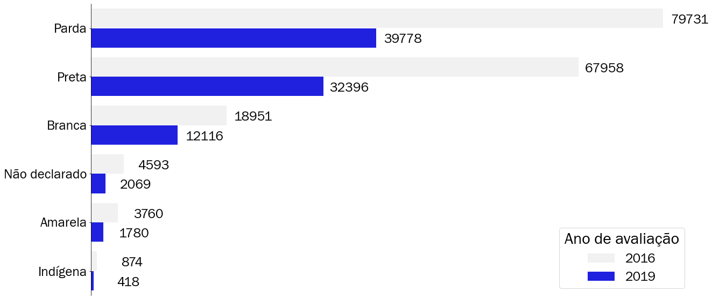

```

Através da Figura \@ref(fig:f32), são apresentados os valores absolutos da quantidade de estudantes que realizaram o ENEM em cada ano identificados pela sua raça. Note que a grande queda encontrada na Figura \@ref(fig:f31) se reflete neste gráfico também: Em comparação a 2016, todas as categorias apresentaram valores menores. Por exemplo, a quantidade pessoas pardas que realizaram o ENEM caiu quase pela metade, assim como as pessoas auto-declaradas como preta. Além disso, podemos notar uma baixíssima quantidade de pessoas indígenas/amarelas que realizaram este exame e que em sua grande maioria, os estudantes da capital baiana se declaram como pardos e negros. 

Essa situação já era esperada e reflete uma realidade já conhecida: Segundo o Instituto Brasileiro de Estatística e Geografia (IBGE), em uma [pesquisa realizada em 2017](https://www.acordacidade.com.br/noticias/203087/ibge-ba-salvador-a-capital-mais-negra-do-brasil-e-com-a-maior-desigualdade-salarial-entre-brancos-e-pretos.html?mobile=true)^2^, Salvador é considerada a capital mais preta do brasil, onde 8 em cada 10 moradores se autodeclaravam de cor preta ou parda.

Note que a Figura \@ref(fig:f32) demonstra também a principal função do gráfico de barras: dimensionar variáveis categóricas de acordo a frequência de suas categorias. **Frequência** para uma variável categórica pode ser definida como a quantidade de vezes que ela é representada, podendo ser dividida em dois tipos: absoluta e relativa. 

A frequência absoluta se trata da representação da quantidade de vezes que cada categoria ocorre. Este tipo de frequência é trabalhada na Figura \@ref(fig:f32), onde apresentamos a quantidade de estudantes por cor/raça que realizaram o ENEM nos anos de 2016 e 2019. Ainda na Figura \@ref(fig:f32), conseguimos notar que todas as categorias apresentaram uma queda na quantidade de estudantes que realizaram em 2016 para 2019, mas e se quisermos comparar este valores ainda utilizando um gráfico de barras, seria possível?

Uma boa forma para comparar essas frequências absolutas distintas seria através do segundo tipo de frequência apresentada anteriormente: a frequência relativa. 

A frequência relativa é definida como uma proporção entre o valor que você quer estimar e o valor máximo esperado. Podemos formular este conceito da seguinte forma:
$$Frequência\ Relativa\ (\%) = 100*\frac{\text{Valor para comparar}}{\text{Valor máximo}}$$

Note que não foi mencionado o valor $100$ presente na fórmula. Ele é apresentado para tornar o resultado da frequência relativa em porcentagem. Para compreender melhor este conceito apresentado, vamos continuar respondendo a segunda questão utilizando agora este novo aprendizado:

```{r f33, fig.cap='Comparação entre os estudantes inscritos de Salvador por cor/raça para 2016 e 2019', out.width='100%', fig.asp=.99, fig.align='center', echo=FALSE}

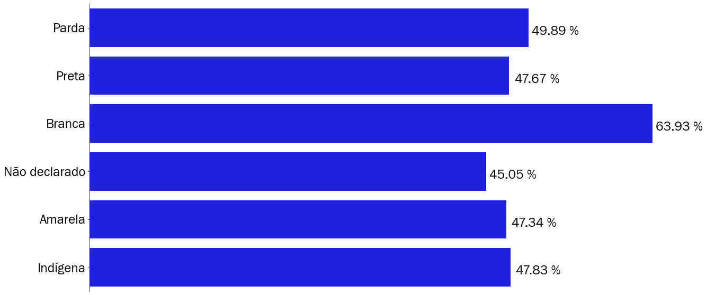

```

A Figura \@ref(fig:f33) pode ser vista como uma extensão da Figura \@ref(fig:f32), utilizando a frequência relativa para apresentar uma informação implícita: a proporção dos estudantes que fizeram o ENEM em 2019 em comparação a quantidade de estudantes que realizaram em 2016. Transcrevendo a fórmula da frequência relativa apresentada anteriormente, temos:
$$Frequência\ Relativa\ (\%) = 100*\frac{\text{estudantes que realizaram o ENEM em 2019}}{\text{estudantes que realizaram o ENEM em 2016}}$$

Como nos é apresentada uma proporção, podemos ler o gráfico de barras apresentado na Figura \@ref(fig:f33) como sendo **a quantidade de estudantes que fizeram a prova em 2019 em relação a quantidade que realizou a prova em 2016**.

Podemos identificar, por exemplo, que com exceção dos estudantes auto-declarados de cor branca todas as outras raças apresentaram uma proporção de aproximadamente 50%, ou seja, o número de estudantes pardos, pretos, amarelos, indígenas e não declarados caíram pela metade em comparação ao ano de 2016. Esta informação confirma ainda mais o resultado apresentado na Figura \@ref(fig:f31), mostrando que ocorreu uma grande queda na quantidade de inscrições no geral, porém isso é verificado com maior intensidade entre estudantes não declarados de cor branca na capital baiana.

Através da análise do gráfico de barras conseguimos avaliar dois questionamentos de uma só vez! Porém para analisar como esses resultados ocorreram de 2016 até 2019 ao invés de dois anos separados, qual seria o melhor tipo de gráfico? Iremos explora-lo na próxima seção deste capítulo.

## Gráfico de tendências {#gtend}

Para responder com mais detalhes os dois questionamentos iniciais trazidos na seção anterior:

- A quantidade de estudantes que realizaram o ENEM aumentou de 2015 para 2019 na capital baiana?

- Como é a distribuição de estudantes em Salvador por cor/raça? Conseguimos identificar algum padrão para esses valores?

Vamos usar o **gráfico de tendências**. Este tipo de gráfico trata a visualização de uma coleção de observações realizadas ao longo do tempo para acompanhar um evento ou processo. Por se tratar de uma coleta sequencial, ou seja, feita uma após a outra torna o fator de ordem é fundamental: importa saber se determinada observação ocorreu antes ou depois de determinado evento.

Este conceito será importante para expandir as análises realizadas apenas com os anos de 2016 e 2019 para a participação dos estudantes de Salvador por cor e raça apresentadas atráves dos gráficos de barras na seção \@ref(gbarras). Será através deste tipo de gráfico que podemos avaliar como essa quantidade de inscrições se comportou (aumentou ou diminuiu) de 2015 até 2019 por raça, acompanhando sua tendência. 

Note que realizamos este mesmo conceito no início da seção \@ref(gbarras) demonstrando o número absoluto de inscrições no ENEM na capital baiana de 2015 até 2019, porém quando vamos avaliar vários anos e possibilidades de raça/cor a utilização do gráficos de barras não demonstra ser a melhor opção, pois a visualização se torna muito carregada (cheio de elementos na tela).

Antes de mergulhar na análise desses dois questionamentos utilizando o gráfico de tendências é importante explorar mais um conceito novo: o plano cartesiano.

``` {r fig34, fig.cap='Plano cartesiano simplificado', out.width='100%', fig.asp=.99, fig.align='center', echo=FALSE}

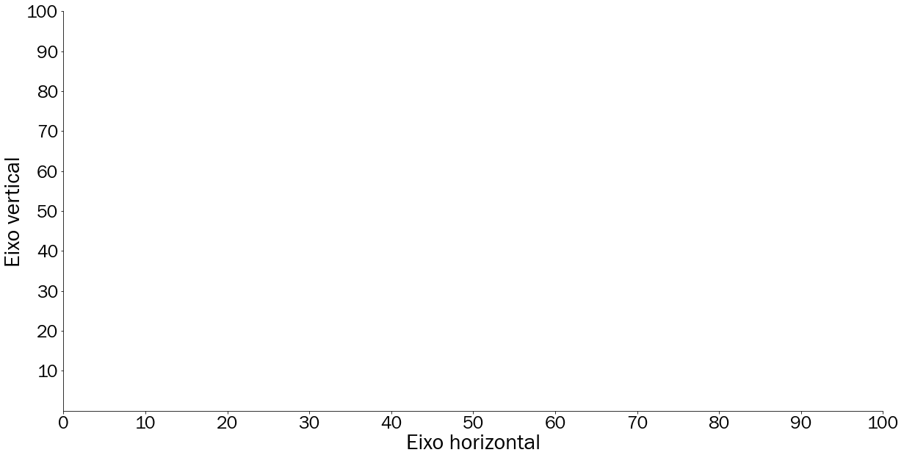

```

A Figura \@ref(fig:fig34) apresenta um plano cartesiano simplificado. São definidos dois eixos principais sendo eles o eixo horizontal e o eixo vertical. Cada eixo pode demonstrar o comportamento de uma variável desejada: Para o eixo horizontal, ao aumentarmos o valor se move para a direita e ao diminuir o valor se move para a esquerda, já para o eixo vertical, ao aumentarmos o valor se move para cima e ao diminuir para baixo. Ter esse conceito em mente será importante para as análises futuras.

```{r f35, fig.cap='Quantidade de estudantes inscritos no ENEM na capital baiana', out.width='100%', fig.asp=.60, fig.align='center', echo=FALSE}

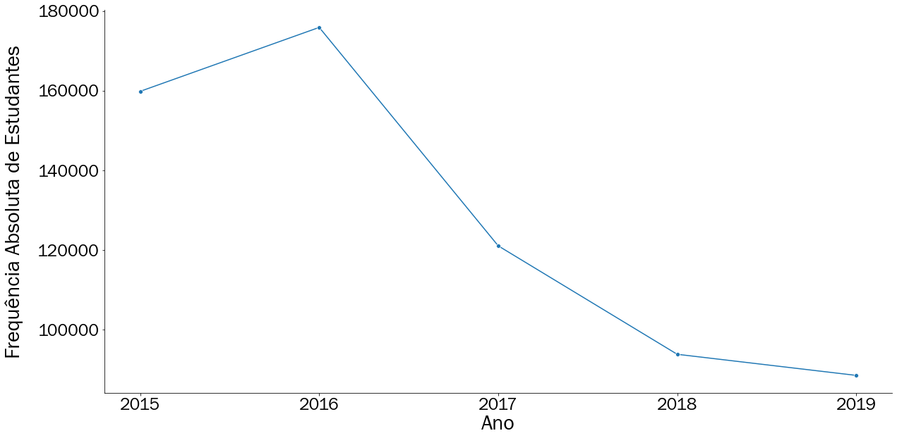

```

O gráfico apresentado na Figura \@ref(fig:f35) fortalece ainda mais a resposta trazida para o primeiro questionamento: o número de estudantes que realizaram este exame não vem aumentando nos últimos cinco anos. É observada uma queda acentuada de 2016 para 2019. Porém através da análise dessa tendência, vemos que a maior queda ocorre de 2016 para 2017 com uma diminuição de mais de 50 mil inscrições. Esse gráfico mostra que a tendência de queda no ENEM não ocorreu de forma abrupta de 2016 para 2019, mas de forma gradual já que a partir de 2016, os valores apenas diminuiram com 2019 sendo o menor deles. 

Ainda neste gráfico, podemos extrair um conceito bem interessante referente a esta modalidade de visualização: o pico. O pico pode ser  definido como o maior valor identificado em um determinado período. No nosso caso, o pico de inscrições no ENEM em Salvador ocorreu em 2016, pois é o maior valor verificado dentro deste intervalo de cinco anos.

```{r f36, fig.cap='Tendência da quantidade de estudantes inscritos no ENEM por cor de 2015 até 2019', out.width='100%', fig.asp=.60, fig.align='center', echo=FALSE}

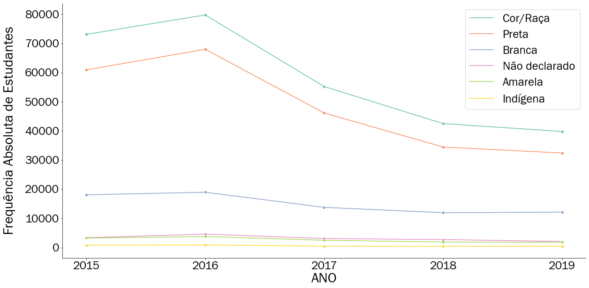
```

A Figura \@ref(fig:f36) é endereçada ao segundo questionamento. Podemos notar que a tendência das duas primeiras curvas, referente as cores parda e preta dos estudantes de Salvador, seguem um padrão similar ao que foi apresentado na Figura \@ref(fig:f35): Ocorre um pico em 2016 e a partir desse ano os valores decaem gradualmente. Porém este padrão fica bem claro para essas duas primeiras curvas, enquanto as outras se mostram aparentemente retilíneas, ou seja, não demonstram grande mudanças. Essa situação requer cuidados, pois podemos acreditar que para as outras opções não ocorreram nenhuma mudança ao decorrer do tempo. Essa divergência está relacionado a grandeza de cada curva: Valores maiores acabam esticando o gráfico, tornando valores pequenos menos representativos. 

Para visualizar melhor e trazer uma melhor discussão a respeito do segundo questiomento, cada curva foi separada de acordo a raça que ela representa:

```{r f37, fig.cap='Tendência da quantidade de estudantes inscritos no ENEM particionado por cor de 2015 até 2019', out.width='80%', fig.asp=.99, fig.align='center', echo=FALSE, warning = FALSE, message=FALSE}

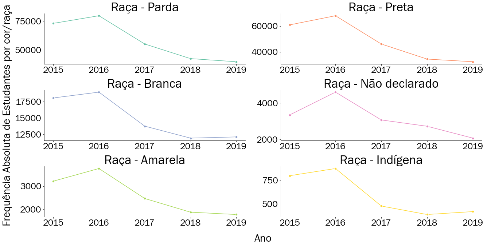
```

Na Figura \@ref(fig:f37) conseguimos notar a diferença de grandezas que foi mencionado anteriormente ao visualizar o eixo vertical (frequência absoluta de estudantes): para a cor parda, por exemplo, é possível enxergar valores próximos de setenta e cinco mil estudantes enquanto para a cor amarela os valores ficam próximos de três mil estudantes mostrando assim uma grande disparidade. Ao separar os gráficos, cada um consegue ter sua própria escala, diferente da Figura \@ref(fig:f36) onde todos compartilhavam o mesmo eixo. 

Respondendo ao segundo questionamento, verifica-se que as raças parda, preta, amarela e as pessoas não declaradas seguem o padrão verificado dos estudantes inscritos em Salvador exposto na Figura \@ref(fig:f35): ocorre um pico em 2016, e a partir desse período os numéros de inscrições apenas caem. Todavía, para as pessoas de cor branca e indígena o padrão se mantém, porém difere em 2019 onde ocorre um leve aumento em comparação ao ano anterior. Esse aumento no entanto é bem diferente ao considerar a ordem de grandeza entre as raças: enquanto para cor branca esse valor aumenta em torno de doze mil estudantes, para os indígenas eles aumentam em torno de 400 estudantes, ou seja, por mais que ambas as inscrições tenham aumentado, o número de inscritos de cor branca é aproximadamente 30 vezes maior que o número de inscritos indígenas.

Através dessa análise gráfica conseguimos compreender e acompanhar como o número de inscritos no ENEM em Salvador veio se alterando nos últimos anos. Essa análise poderia ser utilizada para justificar tomadas de decisão na área da educação, buscando avaliar formas de aumentar a aderência dos estudantes para se inscrever no ENEM, através de programas sociais de fomento a educação. Além disso, é importante ressaltar a importância deste exame para conseguir ingressar nas faculdades ou universidades da cidade ou país, onde em Salvador infelizmente é mostrado uma tendência de saída dos estudantes nesse exame, principalmente aqueles de cor/raça negra e parda. Essa situação apresenta ainda mais a importância de integrar esses indíviduos para compreender a causa/motivo dessa evasão na capital baiana.

## Gráfico de setores {#gset}

Nas seções anteriores, conseguimos entender melhor o panorama dos estudantes de Salvador inscritos no ENEM nos últimos anos e como seus valores foram sendo alterados de acordo a quantidade e raça. Agora iremos avaliar o terceiro questionamento proposto no estudo de perfil: "**Na dita era da informação, onde tudo está conectado, como está o acesso dos estudantes a internet em suas residências? E a computadores pessoais?**". Essa pergunta é importante, pois acredita-se que hoje tudo está conectado e que o acesso a essas ferramentas, facilitadoras do aprendizado, é algo comum a todos, mas ... será? É possível que todos os estudantes do ENEM possuam fácil acesso as essas ferramentas no dias atuais? Iremos buscar responder este questionamento no decorrer deste capítulo.

Para isso será apresentado uma nova modalidade gráfica: o **gráfico de setores**. Este gráfico, usado comumente com variáveis categóricas, apresenta sua forma mais comum equivalente ao desenho de uma "pizza", onde cada fatia é referente a uma determinada categoria e seu tamanho é proporcional a sua representatividade. Para responder o primeiro questionamento, relacionado ao acesso da internet, vamos verificar um cenário mais atual e um cenário mais antigo, sendo respectivamente 2019 e 2015. Será que ocorreu melhorias no acesso à internet pelos estudantes do ENEM em Salvador?

```{r f38, fig.cap='Porcentagem de estudantes inscritos no ENEM em Salvador com acesso a internet em 2015 e 2019', out.width='100%', fig.asp=.99, fig.align='center', echo=FALSE}

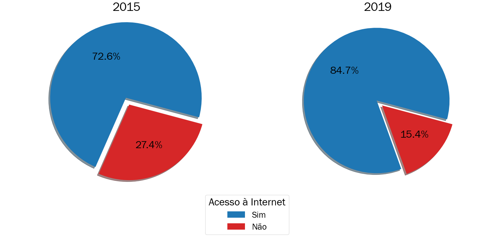
```

Na Figura \@ref(fig:f38) é apresentada a frequência relativa dos estudantes com e sem acesso a internet de acordo ao total de estudantes soteropolitanos inscritos naquele ano. O uso da frequência relativa neste caso permite uma melhor comparação entre os anos e os resultados foram positivos: Em 2015 tinhamos 72,6% estudantes com acesso a internet e esse valor aumentou para 84,7% em 2019, mostrando uma melhora de 12,1%! Essa melhora é mostrada visualmente atráves do tamanho da fatia referente a resposta "Sim" de 2015 para 2019. Este resultado pode estar associado a diversos fatores como mais acessibilidade a esta ferramenta como a redução de custos, aperfeiçoamento dos projetos sociais de inclusão digital e etc. Deixamos a cargo do leitor buscar compreender os motivos que levaram a melhora nestes resultados.

Note que neste tipo de gráfico, ao utilizar frequência relativa, é necessário que a soma dos valores em todos os setores seja igual a 100%, isso não ocorre para o ano de 2015 devido a aproximação decimal utilizada de uma casa decimal.

Conseguimos encontrar parte da resposta do terceiro questionamento: "**Na dita era da informação, onde tudo está conectado, como está o acesso dos estudantes a internet em suas residências?**" E a resposta é que o acesso dos estudantes inscritos no ENEM à internet melhorou de 2015 para 2019, mas e o acesso a computadores pessoais em suas residências? Vamos utilizar novamente os anos de 2015 e 2019 para continuar esta pergunta: 

```{r f39, fig.cap='Porcentagem de estudantes inscritos no ENEM em Salvador com acesso a computadores pessoais em 2015 e 2019', out.width='100%', fig.asp=.99, fig.align='center', echo=FALSE}

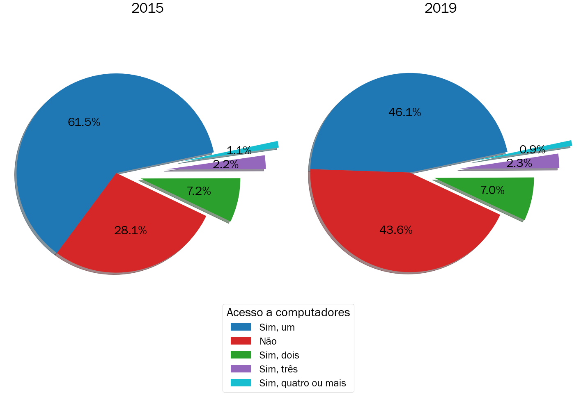

```

Na Figura \@ref(fig:f39) podemos verificar que o questionário do ENEM em relação a esta pergunta possui 5 respostas representativas. Todavia, diferente do acesso a internet conseguimos avaliar que a fatia referente aos estudantes que possuem pelo menos um computador pessoal diminuiu de 61,5% em 2015 para 46,1% em 2019 enquanto o número de estudantes que não possuiam nenhum computador pessoal em sua residência aumentou de 28,1% em 2015 para 43,6% em 2019. A diferença entre essas duas proporções são semelhantes: enquanto uma fatia caiu 15,4% a outra aumentou 15,5% respectivamente. Esse resultado, associado ao encontrado na Figura \@ref(fig:f38) pode indicar que o acesso a internet realizado pelos estudantes podem surgir de outra fonte: o telefone celular, visto a queda considerável no acesso a computadores pessoais durante o mesmo período.

Ainda na Figura \@ref(fig:f39), podemos avaliar que algumas fatias, referentes a estudantes com mais de um computador pessoal, são menos representativas dado o seu tamanho. Essa situação indica um dos problemas ao utilizar este tipo de visualização: quando uma variável possui muitas categorias ou categorias com pouca representatividade pode dificultar a visualização das informações para o leitor. Em casos como esse uma das recomendações é a utilização dos gráficos de barras. Porém existem outras formas de melhorar essa visualização: Como vimos que as categorias mais dominantes se referem aos estudantes sem ou com pelo menos um computador em casa, vamos juntar as categorias: "Sim, dois", "Sim, três" e "Sim, quatro ou mais" em uma só categoria: "Sim, mais de um". Será que isso pode melhorar a visualização do gráfico anterior?

```{r f310, fig.cap='Porcentagem de estudantes inscritos no ENEM em Salvador com acesso a computadores pessoais em 2015 e 2019', out.width='100%', fig.asp=.99, fig.align='center', echo=FALSE}

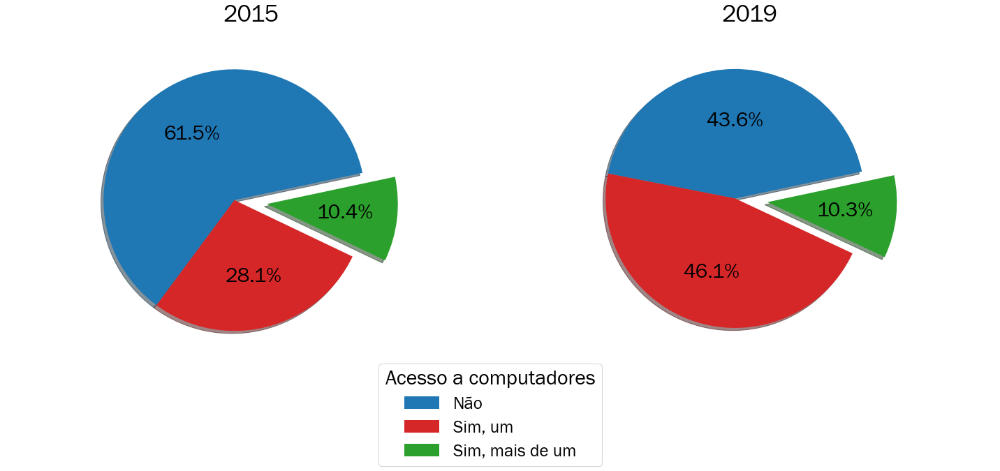

```

Na Figura \@ref(fig:f310) é apresentado o resultado desta alteração. A confecção dessa nova categoria permitiu encontrar uma informação implícita no gráfico anterior: a proporção de estudantes com mais de um computador pessoal em casa se manteve praticamente constante de 2015 para 2019. Isso fortalece ainda mais a narrativa de uma queda na proporção de pessoas com pelo menos um computador pessoal em casa para a proporção de pessoas sem computador pessoal. Esse tipo de informação pode ser utilizada em programas sociais ou intervenções para reverter este quadro e entender quem são as pessoas que sofrem deste tipo de necessidade digital.

Neste momento o leitor pode estar se questionando: Seria possível unir os dois resultados avaliados para este questionamento, acesso à internet e computador pessoal, em um só gráfico? Abaixo é mostrado que sim, podemos.

```{r f311, fig.cap='Porcentagem de estudantes inscritos no ENEM em Salvador sem acesso à internet em relação ao acesso a computadores pessoais em 2015 e 2019', out.width='100%', fig.asp=.99, fig.align='center', echo=FALSE}

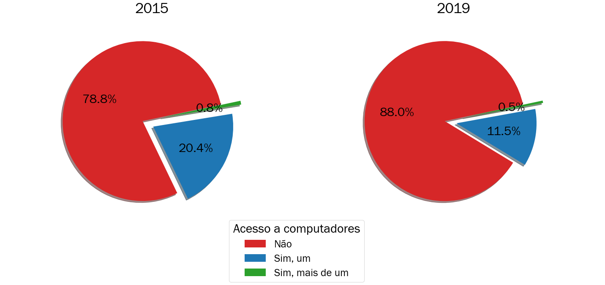

```

Na Figura \@ref(fig:f311) são mostradas as proporções de estudantes de Salvador que não possuem acesso à internet em 2015 e 2019 em relação ao acesso de computador pessoal. Podemos extrair deste gráfico algumas informações:

- Pode existir alguma incongruência na construção dessa base de dados, pois existem estudantes com mais de um computador pessoal, porém sem acesso à internet o que pode gerar questionamentos. Essa situação pode apresentar diversos motivos e uma das hipóteses mais plausíveis seria algum erro do estudante ao responder este questionário.
- É possível verificar que a maioria dos estudantes sem acesso à internet também não possui computadores pessoais em casa. Esta proporção cresce de 78,8% em 2015 para 88,8% em 2019 seguido pela queda da proporção de estudantes que possui pelo menos um computador pessoal em casa.

Essas informações podem indicar uma possível **correlação**, conceito que será estudado em capítulos futuros e de grande importância na área de ciência de dados.

Assim é possível concluir o terceiro questionamento, que nessa era digital as situações melhoraram em partes: ocorreu um aumento, em termos proporcionais, de estudantes com acesso à internet, porém em contrapartida ocorreu um aumento de estudantes sem acesso a pelo menos um computador pessoal em suas residências o que pode dificultar sua navegação e uso desta ferramenta para o seu aprendizado.

## Gráfico de dispersão {#gdisp}

Até o momento conseguimos observar os dados e refletir sobre três  dos quatro questionamentos referente ao perfil dos estudantes de Salvador que realizaram o ENEM. Para responder o quarto questionamento: "**O tipo de escola (pública ou privada) pode influenciar nas notas dos estudantes neste exame?**" vamos utilizar uma nova ferramenta visual: o gráfico de dispersão. Para entender os motivos da escolha desta ferramenta precisamos antes apresentar seu conceito. 

**Gráficos de dispersão** se tratam de representações usando duas ou mais variáveis através das coordenadas cartesianas para exibir valores de um conjunto de dados. Para ficar mais claro este conceito, vamos focar em responder o quarto questionamento utilizando as notas dos estudantes de Salvador no ano de 2019, considerando apenas aqueles que:

- Apresentaram uma pontuação maior que zero em todas as provas, com exceção no exame de Redação

- Definiram o tipo de colégio no ensino médio: público ou privado

Essas condições foram colocadas para evitar valores atípicos nas análises, pois apenas pessoas ausentes no exame possuem suas notas zeradas (com exceção da nota em Redação) e para focar nossa nossa análise em estudantes de escolas públicas e privadas, desconsiderando aqueles que optaram por não informar o tipo de colégio. Além disso é importante mencionar que no ano de 2019, cerca de 75% dos estudantes de Salvador não responderam a questão referente ao tipo de colégio, logo as análises apresentadas aqui representam cerca de 25% dos estudantes inscritos no ENEM 2019 na capital baiana, ou seja, 15996 estudantes no total sendo 10760 de escola pública e 5236 de escola privada.

Inicialmente, será mostrado um gráfico de dispersão para as provas da área de exatas: matemática e ciências naturais, mas não se assuste! O gráfico será explicado passo a passo.

```{r f312, fig.cap='Relação entre nota de Ciências Naturais e Matemática particionado pelo tipo de escola em 2019', out.width='100%', fig.asp=.99, fig.align='center', echo=FALSE}

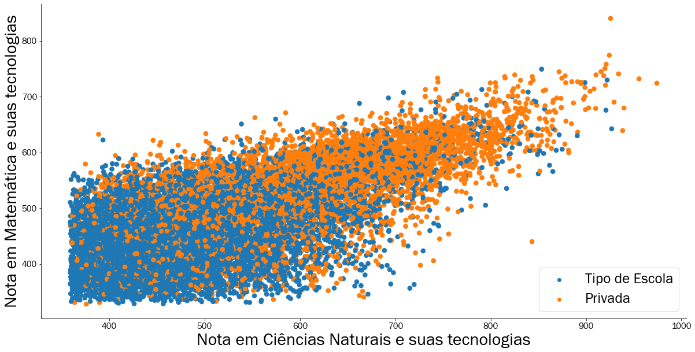

```

Na Figura \@ref(fig:f312) são apresentadas as notas dos estudantes de Salvador em matemática no eixo vertical e no eixo horizontal as notas em ciências naturais, destacando em cores o tipo de colégio: azul escola pública e em amarelo escola privada totalizando assim três variáveis representadas em uma só imagem. Neste gráfico de dispersão são contemplados todos os estudantes que atenderam todos os requisitos expressos anteriormente, onde cada estudante é representado por um ponto de coordenada $(x,\ y)$ ou se preferir $(nota\ em\ ciências\ naturais,\ nota\ em\ matemática)$. Como o ENEM funciona por pontuação, o aluno que apresentar as maiores pontuações em todas as provas possui maior vantagem na escolha de um curso superior, ou seja, os estudantes com melhor rendimento são aqueles que se aproximam do canto superior direito. Apesar desta modalidade gráfica ser bem simples, ela pode trazer resultados interessantes e intuitivos. 

Através da Figura \@ref(fig:f312) podemos verificar que a maioria dos estudantes de escolas públicas se localizam no canto inferior esquerdo, ou seja, estudantes com notas menores em ambas as provas e a medida que crescemos em ambos os eixos, mais dominante se tornam os estudantes de escolas privadas, mostrando um maior rendimento.

Além desta análise, no geral é possível verificar uma **tendência** crescente, onde ao aumentarmos a nota de matemática vemos que a maioria dos estudantes também aumentam a nota em ciências naturais. Compreender tendências deste tipo faz parte do dia a dia do cientista de dados, pois essas tendências são as mais comuns e intuitivas na natureza. Na Figura \@ref(fig:f313) é apresentado dois padrões: em vermelho está uma tendência linear crescente e em azul uma tendência linear decrescente representadas em um plano cartesiano. 

```{r f313, fig.cap='Tendências lineares em um plano cartesiano', out.width='100%', fig.asp=.99, fig.align='center', echo=FALSE}

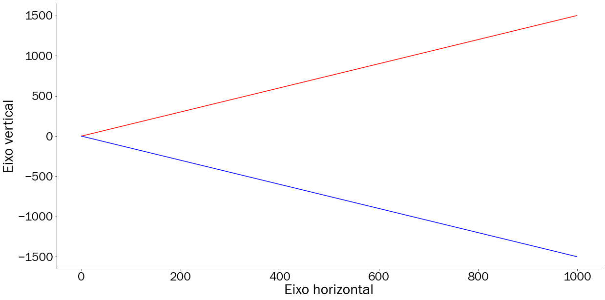

```

É dito linear, pois seu comportamento lembra o formato de uma uma linha: mostra um padrão que está aumentando ou diminuindo a uma taxa constante (fixa).

Os termos crescente e descrescente se referem a como os valores de um eixo se comportam em relação ao outro: na **tendência linear crescente**, ao aumentarmos o valor em um eixo é esperado aumentarmos também o valor no outro eixo, já na **tendência linear decrescente** ocorre o inverso: ao aumentarmos o valor em um dos eixos, é esperado que o valor no outro eixo decaia na mesma proporção.

Na Figura \@ref(fig:f312) conseguimos visualizar o padrão exposto pela reta linear vermelha, ou seja, ao crescermos as notas em matemática, esperamos que cresça as notas em ciências naturais.

Através da Figura \@ref(fig:f312) verificamos que, de certa forma, o tipo de escola que o estudante frequentou possui um fato impacto nas notas dos estudantes de Salvador, porém este padrão se repete caso seja avaliado outra prova?

```{r f314, fig.cap='Relação entre nota de Linguagens e Matemática particionado pelo tipo de escola em 2019', out.width='100%', fig.asp=.99, fig.align='center', echo=FALSE}

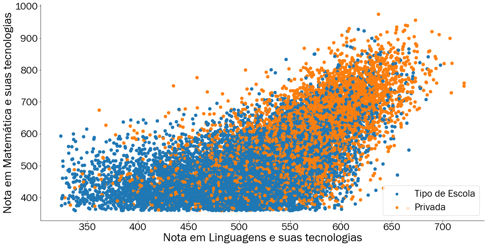

```

A Figura \@ref(fig:f314) apresenta o gráfico de dispersão entre a nota em matemática (eixo vertical) e a nota em Linguagens (eixo horizontal) semelhante a Figura \@ref(fig:f312) e o padrão se repete: no geral, os estudantes de escolas públicas apresentam um rendimento inferior aos estudantes de escolas privadas.

Este conhecimento é importante para ressaltar a necessidade do aperfeiçoamento das escolas públicas no município e buscar formas de reverter ou equiparar este quadro que impacta de forma negativa padrões e classes sociais, dificultando o ingresso de estudantes de escolas públicas em cursos mais concorridos como Engenharia, Direito e Medicina.

## Histograma {#ghist}

Para expandir ainda mais as discussões referentes ao quarto questionamento, vamos utilizar mais uma ferramenta gráfica de visualização: o histograma. Um histograma de um conjunto de dados numéricos se parece muito com um gráfico de barras apresentado anteriormente, embora tenha algumas diferenças importantes que examinaremos nesta seção.

```{r f315, fig.cap='Histograma com as notas de matemática dos estudantes de escolas públicas e privadas de Salvador em 2019 de 300 à 1000 pontos com resolução de 50 pontos', out.width='100%', fig.asp=.99, fig.align='center', echo=FALSE}

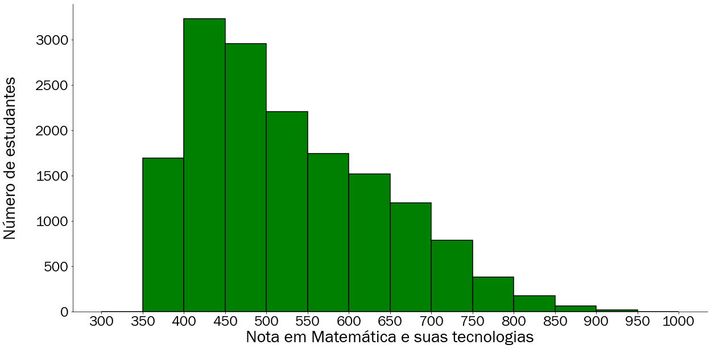

```

A Figura \@ref(fig:f315) apresenta o histograma das notas dos estudantes de escolas públicas e privadas de Salvador em matemática no ano de 2019. No eixo horizontal está representado os valores numéricos das notas dos participantes agrupados em intervalos discretos. Fazendo um paralelo com o capítulo \@ref(cap2), o intervalo contínuo numérico estudado foi transformado para **K** valores categóricos/discretos. Este valor **K** pode ser definido pelo usuário de duas formas: um valor inteiro, onde o algoritmo irá particionar os números em **K** categorias de mesmo tamanho (largura), ou através de intervalos definidos pelo próprio usuário como foi feito na Figura \@ref(fig:f315) onde foi são definidos limites de 50 em 50 pontos começando em 300 pontos até 1000 pontos. Você pode perceber isso ao contar a quantidade de "caixinhas" que existem no histograma. Já o eixo vertical representa a quantidade de valores que estão em cada categoria, ou seja, quanto mais valores são representados por aquela classe maior será a altura de sua barra. Caso você esteja atento, provavelmente notou uma semelhança com a frequência absoluta apresentada durante a seção do gráfico de barras. 

Antes de discutirmos o quarto questionamento, é importante entender que ao avaliar um histograma é preciso compreender que cada barra representa uma categoria que define um intervalo numérico limitado. Esse intervalo é na maioria das vezes apresentado da seguinte forma:
$$[limite\ inferior,\ limite\ superior)$$
Onde o $limite\ inferior$ representa o menor valor contido naquela categoria e $limite\ superior$ o maior valor daquela categoria. Porém, na matemática os sinais $[$ e $)$ apresentam um significado específico, importantes para compreender a definição de uma categoria do histograma: o primeiro representa um intervalo fechado já o segundo um intervalo aberto. 

Juntando todo este conhecimento é possível dizer que cada **K** categoria em um histograma contém seu limite inferior, mas não contém seu limite superior. Em outras palavras, uma determinada barra (categoria) não representa seu limite superior, logo uma categoria começa no limite inferior e termina no superior, sem incluí-lo.

Na \@ref(fig:f315) é possível observar que a medida que aumentamos a nota em matemática menos representativa se torna aquelas categorias, dificultando a visibilidade das barras. Além disso, o intervalo mais dominante se encontra na faixa entre 400 e 450 pontos. Caso seja desejado melhorar a resolução desses intervalos, será necessário realizar o aumento de categorias.

```{r f316, fig.cap='Histograma com as notas de matemática dos estudantes de escolas públicas e privadas de Salvador em 2019 de 300 à 1000 pontos com resolução de 25 pontos', out.width='100%', fig.asp=.99, fig.align='center', echo=FALSE}

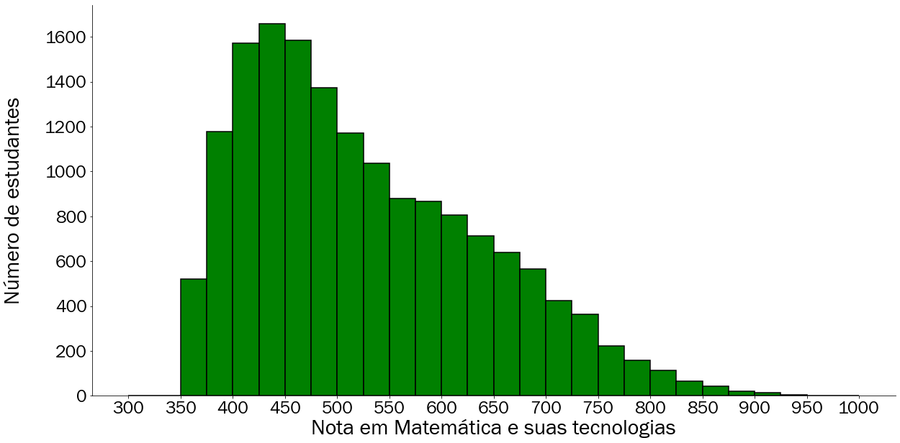

```

Ao utilizar um espaçamento de 25 pontos como apresentado na Figura \@ref(fig:f316) é possível identificar como mais precisão os intervalos de notas dos estudantes da cidade de Salvador. Podemos destacar agora, através da Figura \@ref(fig:f316) que o intervalo mais representado é aquele que começa em 425 pontos até 450 pontos. Isso foi possível graças ao aumento da quantidade de categorias por meio da diminuição do espaçamento de 50 pontos para 25 pontos.

Porém este gráfico apresenta, sem distinção, estudantes de escolas privadas e públicas, mas separando encontramos valores diferentes?

```{r f317, fig.cap='Histograma com 25 categorias de notas de matemática dos estudantes de Salvador em 2019 particionado pelo tipo de escola', out.width='100%', fig.asp=.99, fig.align='center', echo=FALSE}

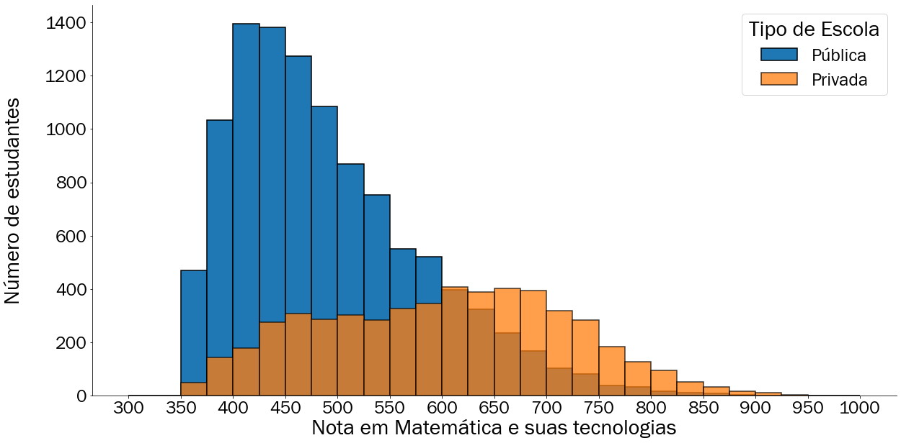

```

A Figura \@ref(fig:f317) mostra o mesmo histograma agora com distinção entre os tipos de escola. Inicialmente verificamos que existe uma diferença na quantidade de estudantes de colégio público e privado na edição de 2019, como apontado na seção anterior. Além disso, é possível verificar que o perfil dos estudantes de colégio público é semelhante ao apresentado na Figura \@ref(fig:f316): O intervalo mais representativo está próximo de 450 pontos, porém e para os estudantes de escola privada os intervalos mais representativos estão em entre 600 e 700 pontos. 

Para uma melhor visualização e contornar o problema de diferença de escala entre os tipos de escolas, visto anteriormente na seção \@ref(gtend), vamos separar os histogramas em diferentes gráficos com seus eixos representativos próprios:

```{r f318, fig.cap='Histograma com 25 categorias de notas de matemática dos estudantes de Salvador em 2019 particionado pelo tipo de escola', out.width='100%', fig.asp=.99, fig.align='center', echo=FALSE}

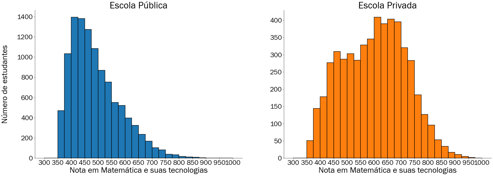

```

A Figura \@ref(fig:f318) apresenta ambos os histogramas lado a lado com escalas de grandezas próprias. Você pode notar isso pelos valores máximos alcançados onde na escola pública foi alcançado aproximadamente 1400 em uma categoria enquanto na escola privada foi alcançado 400 em uma categoria. 

Ainda na Figura \@ref(fig:f318) é possível notar que os valores máximos de cada histogramas são bem diferentes: para escola pública, as categorias mais representativas começam em 400 pontos e vão até 475 pontos, já para as escolas privadas gira em torno de 600 a 700 pontos, apresentando assim uma diferença em torno de 200 pontos de diferença. Além disso, um fator alarmante no histograma que representa os estudantes das escolas públicas é a queda nas notas de matemática a medida que a pontuação (eixo horizontal) aumenta a partir dos 475 pontos. Este padrão também ocorre para as escolas privadas, porém para um valor superior a 700 pontos.

Assim, em relação a nota de matemática, podemos dizer que a resposta para o quarto questionamento: "**O tipo de escola (pública ou privada) pode influenciar nas notas dos estudantes neste exame?**" apresenta uma resposta positiva, ou seja, é possível verificar uma diferença visual entre os tipos de escolas através dos histogramas discussões até o momento. Fica a cargo do leitor avaliar se o comportamento das notas de matemática no ENEM 2019 se repetem para as outras avaliações do exame.

**Nota**: É importante ressaltar que alguns materiais trazem o conceito da densidade para o eixo vertical do histograma, porém dado o direcionamento do livro será mantido uma análise sem abordar este conceito visto sua complexidade. A ideia de densidade é importante quando é analisado histogramas com intervalos de tamanhos diferentes, mas para intervalos iguais tanto o conceito de frequência absoluta (contagem) quanto densidade funcionam para o mesmo propósito.

Após concluir a leitura desta seção você pode notar a semelhança entre **histograma** e **gráfico de barras**, porém não confunda: eles são diferentes! Suas principais diferenças são:

- Os gráficos de barras exibem uma quantidade por categoria. Eles são frequentemente usados para exibir as distribuições de variáveis categóricas. Os histogramas exibem as distribuições de variáveis numéricas.

- Todas as barras em um gráfico de barras têm a mesma largura e há uma quantidade igual de espaço entre as barras consecutivas. As barras de um histograma podem ter larguras diferentes e são contíguas.

## Concluindo ... {#conc}
Através deste capítulo conseguimos entender como a visualição gráfica pode trazer diferentes ideias e esclarecimentos a respeito dos nossos questionamentos, apresentando informações de forma simples e de fácil entendimento. Vimos também que cada gráfico pode trazer uma visão distinta e cabe ao leitor saber escolher qual a melhor abordagem a partir da sua pergunta e conjuntos de dados.
Nosso questionamento sobre o **perfil dos estudantes de Salvador que realizaram o ENEM** conseguiu apresentar diversos *insights*, porém desanimadores. Na Figura \@ref(fig:f319) é apresentado o infográfico resumindo as informações extraídas a partir da análise gráfica.  

```{r f319, echo=FALSE, fig.cap="Infográfico dos resultados encontrados para o nosso questionamento", align = "center", out.width = '99%', fig.align='center'}
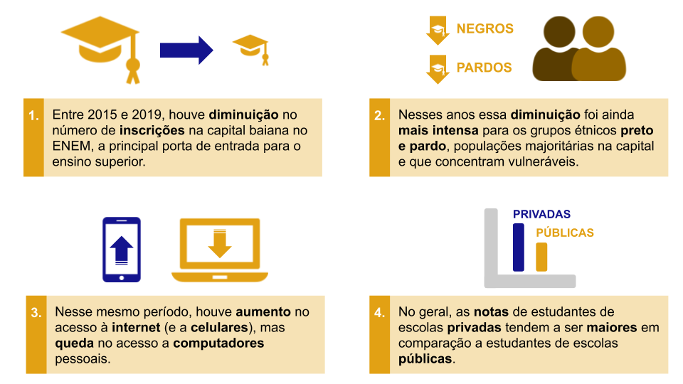
```

Esses resultados são desanimadores, pois no geral mostra uma grande evasão no número de inscritos de estudantes de vulnerabilidade social e um baixo rendimento dos estudantes de escolas públicas em comparação aos de escola privada. Todavia, para confirmar esses resultados apenas a visualização gráfica é insuficiente: Na ciência de dados precisamos de indicadores e medidas matemáticas para expressar se de nossas hipóteses são verídicas. Esse ferramental será explorado nos próximos capítulos deste livro, então mantenha o estudo!

## Indo Além
Fizemos diversas análises e respondemos alguns questionamentos a respeito do **perfil dos estudantes de Salvador que realizaram o ENEM** não foi? Porém com a riqueza que esta base de dados possui o leitor pode explorar ainda mais!

Utilizando Python, explicada em nosso capítulo de programação, você conseguiria **ir além** e responder os seguintes questionamentos?

- Através do infográfico na Figura \@ref(fig:f319) avaliamos que ocorreu um aumento no número de estudantes sem acesso a computadores pessoais no ENEM de 2015 para 2019, o que pode dificultar os estudos desta parcela de estudantes. Você consegue avaliar a distribuição de cor/raça para esses estudantes em 2019 utilizando o gráfico de barras?

- Na seção \@ref(ghist) verificamos que, infelizmente, na edição de 2019 do ENEM as notas dos estudantes de escolas públicas são menores em comparação aos estudantes de escolas privadas para a prova de Matemática. Utilizando o histograma, você consegue avaliar se este padrão se repete para as notas de Linguagens nesta mesma edição?

## Citações no capítulo
[1] Instituto Nacional de Estudos e Pesquisas Educacionais Anísio Teixeira. **Microdados Exame Nacional do Ensino Médio**. Disponível em: [link de acesso](http://inep.gov.br/microdados)

[2] Acorda Cidade. **IBGE-BA: Salvador é a capital mais negra do Brasil e com a maior desigualdade salarial entre brancos e pretos**. Publicado em 19 de novembro de 2018. Disponível em: [link de acesso](https://www.acordacidade.com.br/noticias/203087/ibge-ba-salvador-a-capital-mais-negra-do-brasil-e-com-a-maior-desigualdade-salarial-entre-brancos-e-pretos.html)

