# Correlação e Causalidade {#cap4}

Sempre buscamos saber o que leva um fato a ocorrer, não é mesmo? A Figura \@ref(fig:figura41) abaixo trás alguns tipos de questionamentos que fazem parte da nossa vida. 

```{r figura41, echo=FALSE, fig.cap="Questionamentos", align = "center", out.width = '80%', fig.align='center'}

```

Além destes exemplos, mas em diversas situações cotidianas atribuímos causas a fatos que nem sempre condizem à realidade e, mais precisamente, sem respaldo estatístico. Isto porquê, nossa mente sempre busca encontrar padrões, ainda que eles não existam. 

Portanto, neste capítulo vamos aprender os conceitos: **Correlação** e **Causalidade**. Não basta conhecer estes termos, é preciso saber interpretá-los. 

Por isto, a partir de agora vamos iniciar uma discussão super interessante que irá nos ajudar neste aprendizado!
Para compreender estes conceitos, vamos utilizar dados voltados ao desempenho de atletas. Desta forma, poderemos analisar quais variáveis se relacionam com resultados das provas realizadas. A base de dados utilizada foi adaptada da plataforma [kaggle](https://www.kaggle.com/beyzanurarslan/best-women-volleyball-players-eda-visualization). 


## O que é correlação? {#cap4.1}

Dizemos que há correlação, quando verifica-se uma relação de associação entre duas variáveis! Neste caso, é possível verificar para as duas variáveis, ao mesmo tempo, uma tendência no comportamento. Para entender melhor, imagine que estamos avaliando se pessoas com maior massa corporal (kg) consomem mais água durante o dia. Caso esta hipótese seja confirmada, significa que *a depender* da massa corporal do indivíduo, a quantidade de água ingerida irá *variar*. Assim acontece em outros casos, o estudo de correlação busca descobrir se variações em uma característica se associa à variações em outra característica. 

Vamos iniciar com um estudo de caso. Queremos saber quais variáveis *estão associadas* a pontuação total em partidas de vôlei. Esta condição é definida pelas variáveis "Ranking All", que trata a pontuação de todos os anos e "Ranking 2020", que trata do ano 2020. Observe na Figura \@ref(fig:figura42) as variáveis que possuímos. Perceba que existem variáveis numéricas e também categóricas.  

```{r figura42, echo=FALSE, fig.cap="Trecho de base de dados utilizada", align = "center", out.width = '100%', fig.align='center'}
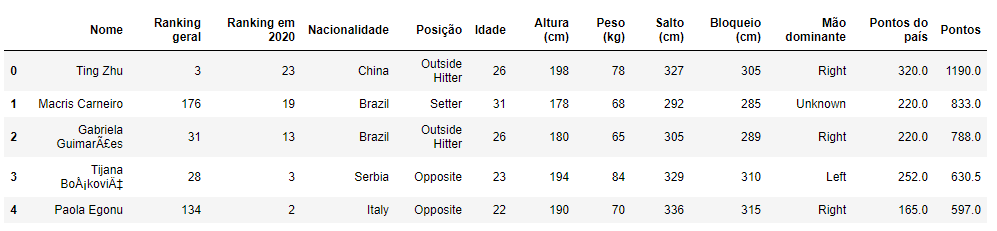
```

Para seguir a convenção estatística, denominamos "Ranking Geral" e "Ranking 2020" como *variável resposta* ou *dependente* ou ainda, *variável Y*. O comportamento delas pode estar associado à alterações de outras variáveis da tabela. Assim, estas duas variáveis são as respostas que queremos avaliar na nossa análise. O restante das variáveis são denominadas *variável independente*, *variável X*, pois é a partir das variações delas é que poderemos avaliar as respostas na saída.

_Ao verificar a parte dos dados exibida na Figura \@ref(fig:figura41), sem qualquer informação prévia, qual destas variáveis você acredita que mais influencia o Ranking?_ 

> _Pesquisando na literatura, vemos que estudos de correlação foram realizados em jogadores de vôlei. Variáveis diferentes foram avaliadas, mas no final, fica claro a importância deste conteúdo para gerar melhorias e estratégias de treino._   
> Um estudo de Crivelin et al., 2015 indicou alta correlação entre a composição corporal de jogadores (variável X) e a altura do salto em cm (variável Y).  
> Outro estudo (de Marques Junior, 2015) investigou os fundamentos do vôlei que geram pontos ao longo de uma partida. Assim, foi indicada uma alta correlação entre o ataque, bloqueio e saque (nesta ordem) para a realização de pontuação. 

A Correlação (ou Associação) pode ser definida pelo seu **sentido** e ser vizualizada em um Diagrama de dispersão. Assim, ocorrem três formas distintas de correlação: 

```{r figura43, echo=FALSE, fig.cap="Tipos de correlação", align = "center", out.width = '80%', fig.align='center'}
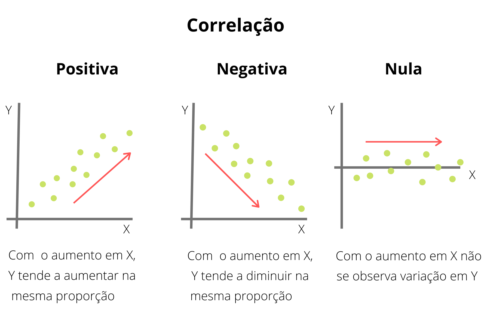
```

## Quão forte é a correlação? {#cap4.2}

Além do sentido, uma forma de melhor entender a correlação é através da análise do **grau** ou **intensidade** que ocorre. Esta força, ou intensidade é avaliada a partir do **coeficiente de correlação**, um valor numérico que indica o **grau** e a **direção** da tendência de associação entre as variáveis. Vamos comentar duas formas de cálculo do Coeficiente de Correlação. Todavia, é importante você saber que existem outras formas e escolher aplicá-los irá depender das características verificadas na sua amostra.

### Coeficiente de Pearson {#cap4.2.1}

Este coeficiente é representado pela letra *r* e também pode ser chamado de *correlação linear* ou *r de Pearson*. Seus valores se situam entre *-1* e *+1*, e a interpretação ocorre da forma indicada na Figura \@ref(fig:figura44). Se a correlação é 0, significa que não há associação entre as variáveis. Quando o valor do r de Pearson é 1, independente do sentido, dizemos que esta correlação é perfeita, é a mais forte possível. Quanto mais próximo de zero, menor é a correlação. Vale lembrar que este coeficiente expressa o grau de associação entre duas **variáveis quantitativas**. 

```{r figura44, echo=FALSE, fig.cap="Coeficiente de Pearson", align = "center", out.width = '70%', fig.align='center'}
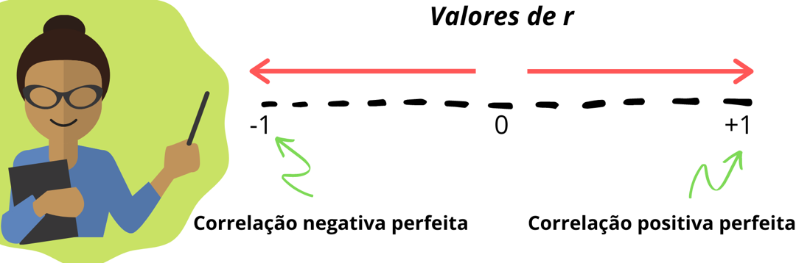
```

É comum optarmos por verificar o grau de associação por meio de uma **Matriz de correlação**. Observe a Figura \@ref(fig:figura45), que representa a matriz de correlação dos dados estudados. 

```{r figura45, echo=FALSE, fig.cap="Matriz de correlação - Pearson", align = "center", out.width = '100%', fig.align='center'}
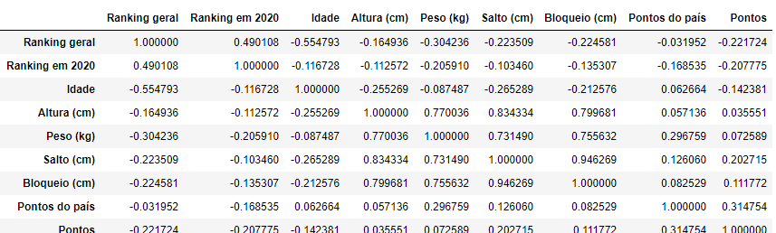
```

Sabendo que estamos avaliando quais fatores podem influenciar a posição de um país no Rankin geral ou no Ranking de 2020, localize nesta tabela as linhas que indicam a associação entre estas duas variáveis com todas as outras. 

Observe que para a variável reposta Ranking geral, as variáveis Ranking em 2020, Idade e Peso (kg) são as que apresentam maior grau de associação. Já para o Ranking em 2020, as variáveis que apresentam maior grau de associação são Ranking geral, Peso e Pontos.  

Que tal visualizar esta matriz em forma gráfica? Veja a Figura \@ref(fig:figura46) e tente entender as informações. 

```{r figura46, echo=FALSE, fig.cap="Gráfico - Matriz de correlação", align = "center", out.width = '80%', fig.align='center'}
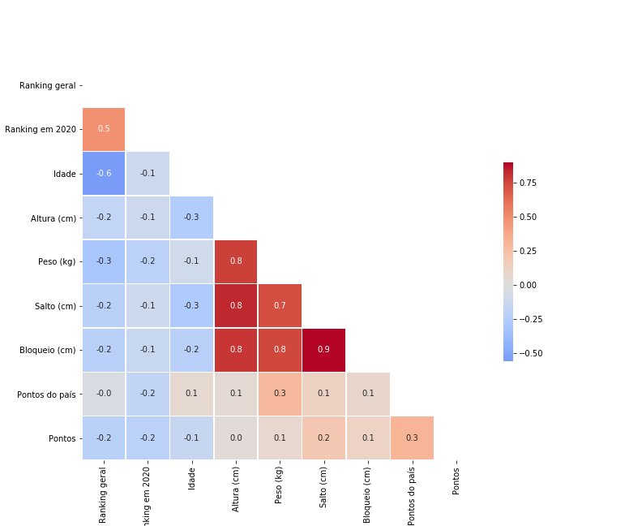
```

Esta forma de representação é bastante completa. Isto porque utiliza cores e também adiciona o valor numérico do cálculo do correlação entre as variáveis. 

A esta altura você já deve ter percebido que a coloração vermelha indica valores de correlação positivos, enquanto as tonalidades em azul indicam os valores negativos. A intensidade das cores indica a força da correlação. Ou seja, quanto mais próximo de 1 for o valor de *r*, mais forte será a tonalidade. 

Localize a variável "Ranking geral" e veja sua associação com as variáveis restantes. Percebemos que seu grau de associação com a variável "Ranking em 2020" é 0,5, por isso a tonalidade indicada na caixa é em tom vermelho. Já com a variável Idade a correlação é -0,6, com tonalidade azul. Este valor negativo indica que quanto maior a idade das jogadoras, menor as notas no ranking geral.
Esta informação é relevante, uma vez que a Idade influencia o desempenho de atletas e é um dos principais fatores que levam à aposentadoria destes profissionais ([Agresta et al., 2008](https://www.scielo.br/scielo.php?script=sci_arttext&pid=S1517-86922008000600006). 

Observe também que a correlação com as outras variáveis tem sentido negativo e são bastante fracas, se aproximando de zero. Desta forma, podemos dizer que estas variáveis praticamente não são relacionadas a Ranking geral. O mesmo pode-se dizer quanto ao Ranking em 2020. Vale destacar que a correlação de uma variável com ela mesma sempre será 1.  

Também podemos optar por visualizar a correlação separadamente. Assim, comparamos apenas a variável dependente *versus* a variável independente. Verifique graficamente a associação entre Pontos (variável de entrada) e Raking Geral (variável de saída). 

```{r figura47, echo=FALSE, fig.cap="Associação entre Pontos e Ranking geral", align = "center", out.width = '50%', fig.align='center'}
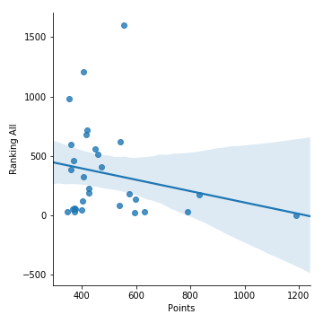
```

Ao observar este gráfico, não percebemos uma tendência, um comportamento que indique associação entre estas variáveis. As observações estão dispersas pelo gráfico, não indicando um padrão associativo e a reta plotada praticamente não tem inclinação.

Verifique agora a associação de Pontos com Ranking 2020. 

```{r figura48, echo=FALSE, fig.cap="Associação entre Pontos e Ranking em 2020", align = "center", out.width = '50%', fig.align='center'}
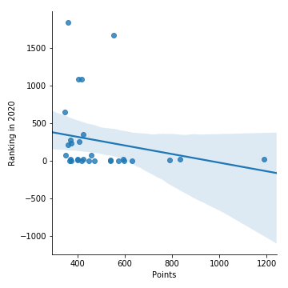
```

Ocorre a mesma situação anterior, o que indica que Ranking 2020 também não se associa com Points. Ou seja, mesmo que a variável Points sofra variações, isto não irá interferir em Ranking All ou Ranking 2020.

> Já sabemos que o valor 0 indica que não há correlação, e que o valor de 1 indica o maior grau desta estatística. Mas, como classificar os outros valores encontrados? Observe a Figura \@ref(fig:figura49) abaixo:

```{r figura49, echo=FALSE, fig.cap="Hieraquia de valores - Correlação", align = "center", out.width = '50%', fig.align='center'}
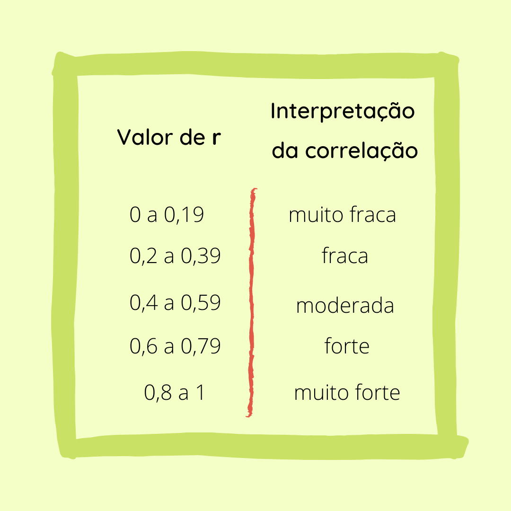
```

### Coeficiente de Spearman {#cap4.2.2}

Assim como o *r de Pearson*, esta métrica também se situa entre -1 e 1. A diferença é que neste caso não existe a obrigatoriedade de haver relação linear entre as variáveis. Deste modo, este coeficente avalia se as variáveis apresentam uma relação, mas a mudança delas não necessariamente precisa ser a uma mesma taxa.   

Veja a Figura \@ref(fig:figura410) com a matriz de correlação para o Coeficiente de Spearman. 

```{r figura410, echo=FALSE, fig.cap="Correlação de Spearman", align = "center", out.width = '80%', fig.align='center'}
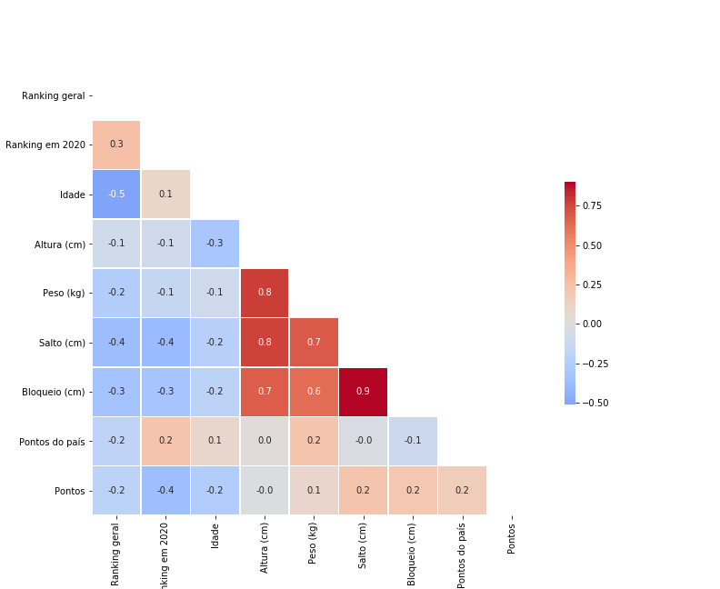
```

Observamos que alguns valores se diferenciam daqueles apresentados pela correlação de Pearson na \@ref(fig:figura43). Apesar destas variáveis terem um baixo/ moderado grau de associação, ao se utilizar a correlação de Spearman nota-se para algumas delas (Salto (cm), Pontos e Bloqueio (cm)) um coeficiente de correlação maior do que o obtido pela correlação de Pearson, indicando que o relacionamento entre elas não necessariamente é linear. Por isto a diferença de valores apresentada na Figura \@ref(fig:figura411). 

```{r figura411, echo=FALSE, fig.cap="Comparação Spearman e Pearson", align = "center", out.width = '60%', fig.align='center'}
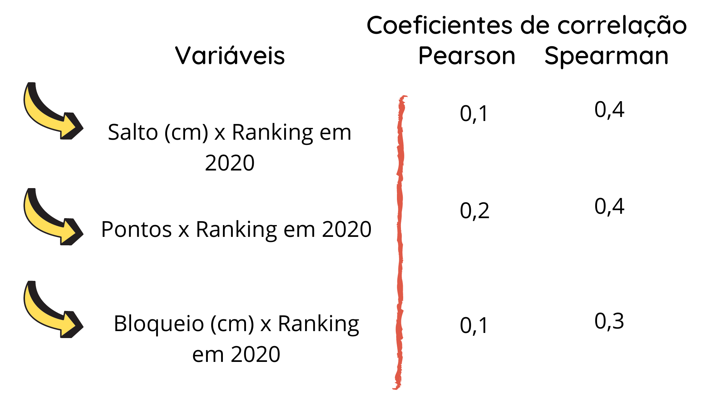
```

> Correlações categóricas  
Até agora utilizamos apenas dados numéricos para quantificar a correlação. Mas, e quanto às informações categóricas que possuímos, elas devem ser desconsideradas?  
A resposta é não. Existem formas de se avaliar o grau de associação de variáveis qualitativas, como: qui-quadrado, coeficiente phi, V de cramer e outras.  

### Multicolinearidade {#cap4.2.3}

Quando observamos todas as linhas e colunas da matriz de correlação, percebemos que outras variáveis (variáveis de entrada), também apresentam um valor de correlação. Isto indica que elas apresentam uma relação entre si. 

Veja na figura que existe um grupo de variáveis de entrada com altos valores de correlação positiva. Peso, Spike e Block! Isto significa que estas variáveis tem uma interação entre si. Quando isto ocorre dizemos que há *multicolinearidade*. 

Podemos visualizar este comportamento de forma gráfica. Observe na Figura \@ref(fig:figura412), a plotagem entre estas variáveis e observe a tendência entre elas.

```{r figura412, echo=FALSE, fig.cap="Associação entre variáveis independentes", align = "center", out.width = '100%', fig.align='center'}
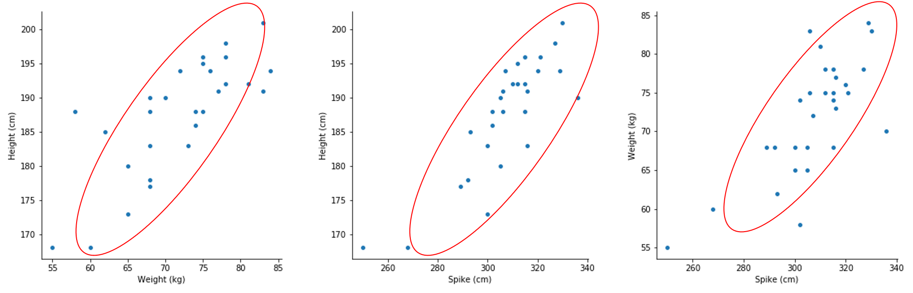
```

Basicamente, percebemos que os pontos estão dispersos, porém, apresentam uma tendência crescente em todos os gráficos. Isto possibilita até mesmo traçar uma linha de tendência para observarmos melhor. Assim, precebemos associação linear crescente entre Altura e peso; altura e salto; peso e salto.   

Em geral, espera-se que em um conjunto, as variáveis de entrada praticamente não apresentem correlação entre si e apenas se associem à variável de saída. Isto porque, a multicolinearidade pode nos confundir quanto ao comportamento observado na variável resposta. 


### Considerações sobre a análise {#cap4.2.4}

Verificamos que a relação de associação das variáveis avaliadas é muito baixa em relação às variáveis dependentes (Ranking 2020 e Ranking geral). Vale ressaltar que aplicamos métodos que consideram variáveis numéricas e, portanto, não avaliamos as variáveis categóricas. Assim, é possível que estas variáveis tenham uma maior relação com os resultados de Ranking. 

## Relações de causa e efeito: conhecendo a causalidade {#cap4.3}

De acordo com o [dicionário](https://www.dicio.com.br/causalidade/), a palavra "causalidade" se refere à condição ou qualidade do que é causal, do que produz efeito. É uma relação direta entre causa-efeito.Veja estas frases e reflita sobre a mensagem que você compreende. 

<style>
div.blue { background-color:#e6f0ff; border-radius: 5px; padding: 20px;}
</style>
<div class = "blue">
> a) Pare o aquecimento global: se torne um pirata  
> b) Habilidades em linguagens reduzem ataques de raiva na pré escola  
> c) Qual a causa de câncer?
> d) chocolate faz bem? </div>

Observe que estas frases passam uma relação imediata de causa e efeito entre as variáveis. Em "a", dá a entender que é possível parar o aquecimento global ao se tornar um pirata. Mas, será que estas alegações fazem sentido?

Uma relação de causa-efeito pode ser descrita por meio de palavras como *impacta*, *afeta* ou *efeito*. Deste modo, este tipo de relação sugere que duas variáveis não apenas aparecem juntas, mas que o fato de uma delas ocorrer automaticamente causa o surgimento da outra.   

Observe este outro exemplo: Em países do hemisfério norte as pessoas gastam mais em compras no frio. À primeira vista, tendemos a achar que o frio provoca um aumento nas vendas. Porém, se pensarmos um pouco vamos perceber que datas festivas como Natal e Ano Novo nestes países, ocorrem no inverno. Portanto, esta pode ser a causa do aumento das compras. 

Ou seja, não podemos simplesmente atribuir uma relação de causa e efeito a um evento, pois podem haver muitos fatores que influenciam este contexto. 

### Coincidência ou Causalidade? {#cap4.3.1}

A única forma de provar uma causalidade é a partir de uma análise detalhada dos dados. Estas análises são realizadas por meio de *estudos observacionais* ou *estudos experimentais aleatório*, em um grupo de indivíduos divididos em: *grupo controle* e *grupo de tratamento*. Este último sofre intervenção por algum fator que se deseja analisar. Estes grupos são monitorados às mesmas condições, e a diferença nas respostas finais são computadas. 

Uma questão central para respondermos é se de fato o tratamento aplicado produz em efeito na resposta obtida. Caso isto ocorra, a associação é causal. Observe que quando investigamos a causalidade, não queremos saber apenas se há uma associação entre variáveis. Mas sim, se esta relação implica diretamente causa-efeito. 

Desta forma, afirmar a ocorrência de causalidade exige duas etapas:

1 - Observar uma associação entre variáveis  
2 - Análise cuidadosa de causalidade

Algumas situação não permitem a realização de experimentos aleatórios, ainda que seja para verificar a causalidade. Por exemplo, se qusiermos avaliar a os efeitos do consumo de ácool durante a gravidez, deveríamos convidr algumas grávidas para o nosso experimento. Mas, isto seria sensato? Em situações deste tipo, deve ser realizado um estudo observacional. 

Se o grupo de tratamento e o grupo de controle apresentarem diferenças além do tratamento aplicado, tomar conclusões sobre a causalidade se torna algo difícil. Neste caso, chamamos esta diferença de **fator de confusão**.

Vamos entender melhor a partir de um exemplo. Nos anos 60, alguns estudos apontaram que pessoas que ingeriam café tinham altas taxas de câncer de pulmão se comparadas às que não ingeriam. Devido a isto, algumas pessoas começaram a atribuir o café como causa de câncer de pulmão. Porém, hoje sabemos que café não é a causa desta doença! Na verdade, esta análise tinha um fator de confusão: o hábito de fumar. Naquela época, pessoas que ingeriam café provavekmente também tinham o hábito de fumar. E esta prática sim, causa câncer de pulmão. Então, podemos concluir que: o consumo de café estava associado ao cancer de pulmão, porém não é o causador da doença!

Bom, os fatores de confusão são bastantes comuns. Mas estudos confiáveis tomam bastante cuidado para reduzir esta *confusão* e saber o quanto ela afeta a análise.

## Correlações expúrias {#cap4.4}

Bom, já aprendemos o conceito de correlação e também sabemos que a correção não implica causalidade. Veja a Figura \@ref(fig:figura413) e avalie a tendência entre afogamentos e aparições do ator Nicholas Cage em filmes. 

```{r figura413, echo=FALSE, fig.cap="Afogamentos e aparições do Nicholas Cage", align = "center", out.width = '100%', fig.align='center'}
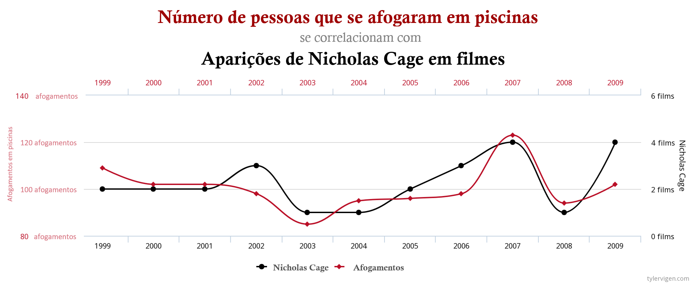
```

A associação entre estas variáveis é nítida, não é mesmo? Portanto, claro que elas são correlacionadas (r = 0,666) e mais, a causa dos afogamentos é a aparição do Nicholas Cage em filmes! 

Claramente esta afirmação está ERRADA!!

```{r, echo=FALSE, align = "center", out.width = '50%', fig.align='center'}
knitr::include_graphics("fig_cap4/gif_cap4.gif")
```


Assim como muitas outras afirmações que ouvimos no nosso dia a dia que são bastante questionáveis, esta afirmação reflete uma certa negligência à compreensão de Correlação e Causalidade.Ainda que esta relação seja visível graficamente, o nosso senso crítico precisa prevalecer, caso contrário seguiremos acreditando em informações dúbias e tomando decisões incorretas.

Para não sermos reféns deste tipo de conclusão, precisamos saber de dois fatores que acarretam esta conclusão errônea:

1 - o primeiro deles é o já citado **fator de confusão**: ou uma terceira variável que afeta o resultado, que não está sendo considerada.  
2 - Acaso: sim, coincidências acontecem e precisamos ter criticidade para avaliar se a informação é lógica. 

Uma crítica semelhante pode ser feita ao caso seguinte. Em alguns meses do ano, foi observado que o número de afogamentos aumenta. Ao mesmo tempo, as vendas de sorvete também aumentam! Antes de você refletir, vamos a mais informações. Os meses recorde de afogamentos e vendas de sorvete são Dezembro e Janeiro. Segundo os dados estas variáveis estão correlacionadas positivamente, com um r = 0,98. E mais do que isso, será que poderíamos concluir que as vendas de sorvete causam afogamentos? Errado. Temos uma terceira variável em comum a estas duas, a Temperatura. Em dias mais quentes as pessoas vão à praia, ou tomam sorvete, e com isso, mais pessoas ficam expostas à chances de afogamento. Portanto, neste problema deve ser levado em conta a Temperatura, que está associada aos afogamentos e às vendas de sorvete. 

## Considerações Finais {#cap4.5}

Neste capítulo, aprendemos a avaliar afirmações, com embasamento estatístico. A Figura \@ref(fig:figura415) exibe um mapa conceitual do que foi discutido. 

```{r figura415, echo=FALSE, fig.cap="Mapa conceitual do capítulo 4", align = "center", out.width = '100%', fig.align='center'}
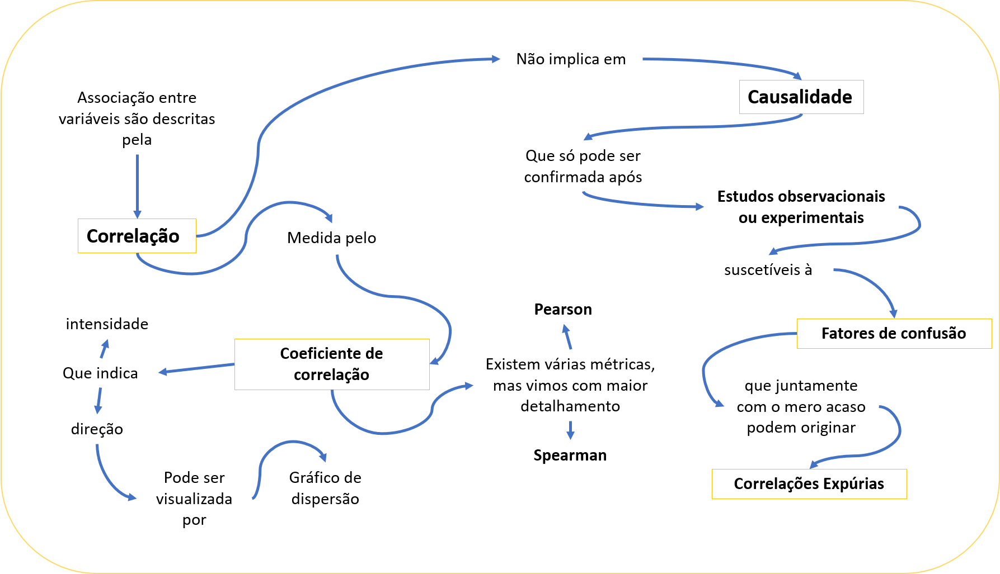
```

O que achou do tema deste capítulo? Com certeza, a partir de hoje você será muito mais crítico ao ler ou ouvir uma informação. É exatamente isto que buscamos, ter um senso crítico em relação às informações que nos chegam e conhecer formas que garantam que elas sejam corretas! 

## Indo além {#cap4.6}
_Em progresso_

## Referências {-}

[1]https://www.tylervigen.com/spurious-correlations: Correlações espúrias
[2]https://www.inferentialthinking.com/chapters/intro.html: Inferential Thinking. Causality and Experiments. UC Berkeley.  
[3]https://curriculum.idsucla.org/table/ : IDS Curriculum v5_0 

