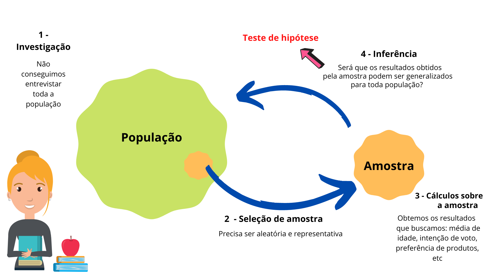
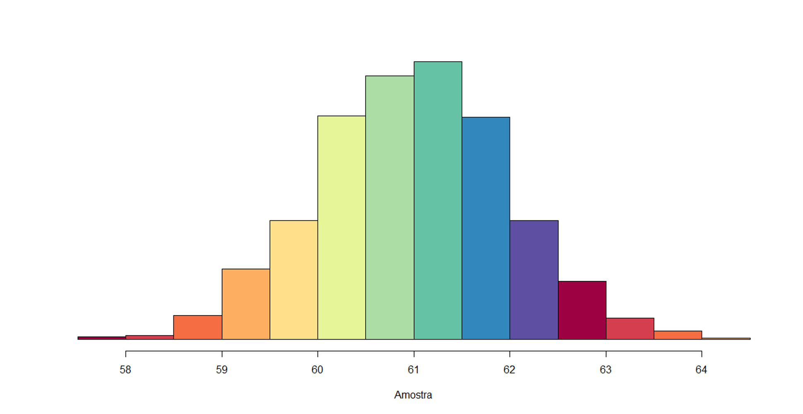
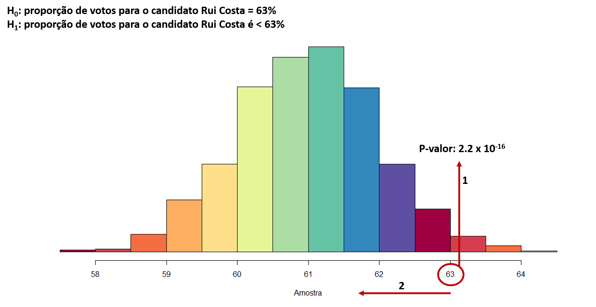
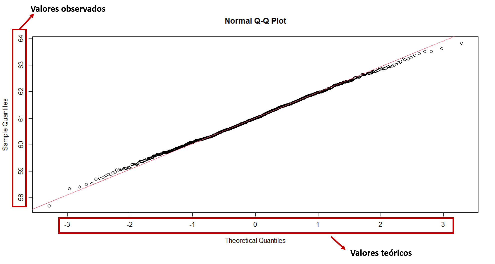
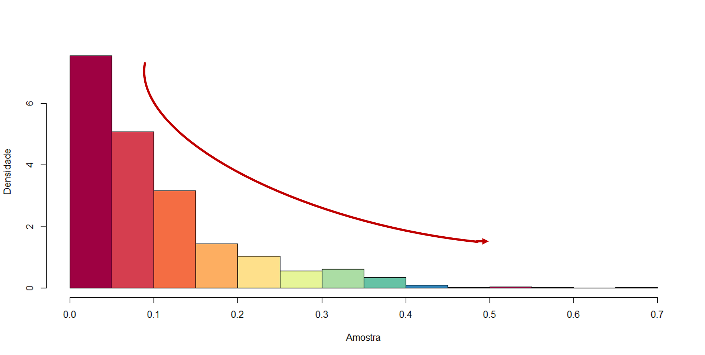
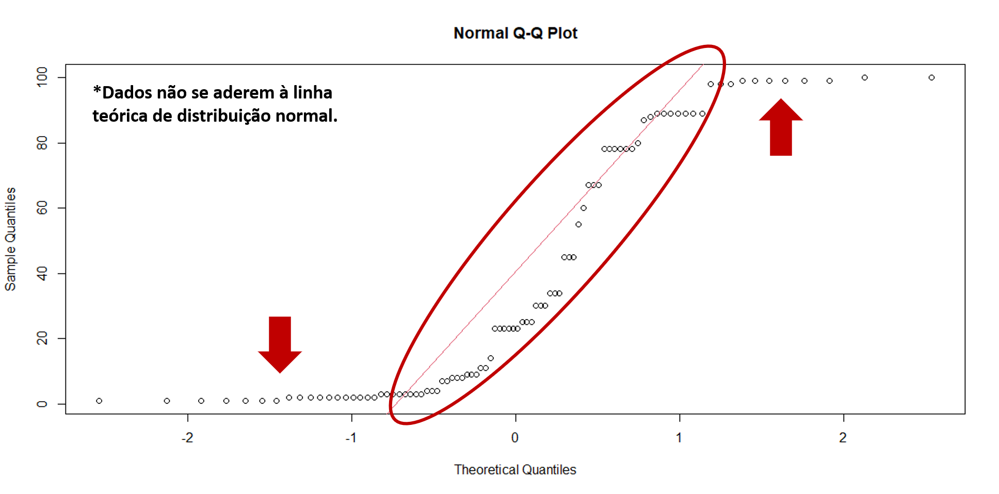
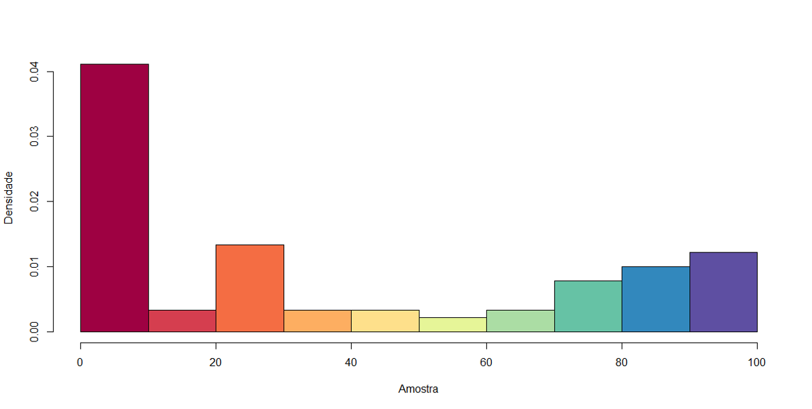
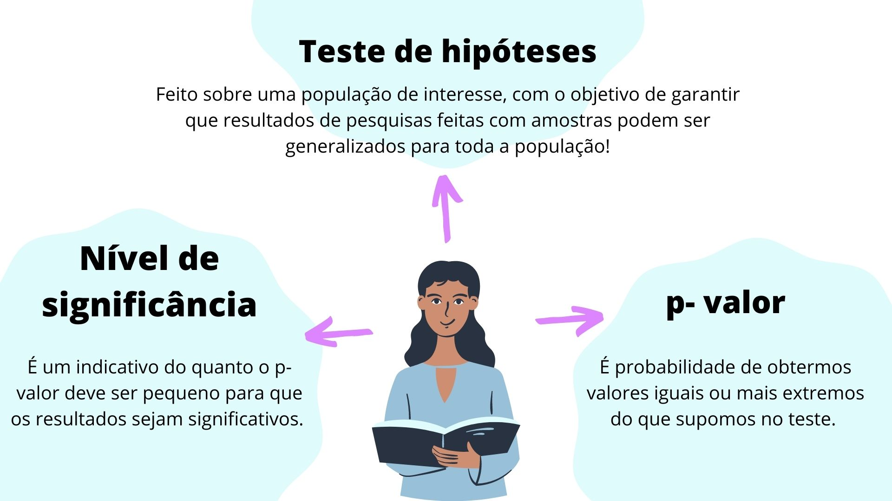

# Entendendo e Avaliando sua Hipóteses {#cap8}

Olá, neste capítulo iremos aprender sobre o **Teste de Hipóteses**.Ele é mais uma das ferramentas estatísticas que nos permite tomar decisões com base nas informações que obtivemos de uma amostra! 

Lembre-se que: quando selecionamos uma amostra precisamos atender alguns pressupostos que foram discutidos nos capítulos \@ref(cap6) e \@ref(cap7). Se as condições de seleção estiverem adequadas, então dizemos que esta amostra representa bem a população, não é mesmo? Com isso, qualquer estatística que calcularmos sobre a amostra poderá ser generalizada para a nossa população. Uma forma de comprovar isto é fazendo o teste de Hipóteses. 

Mas a discussão não para por aqui. Ainda temos muita coisa interessante para aprender! Então, vamos começar? 

## O que é "Teste de Hipóteses"? {#cap8.1}

Vamos utilizar um exemplo sobre pesquisas eleitorais. Observe as manchetes na Figura \@ref(fig:figura81) e tente compreendê-las. 

```{r figura81, echo=FALSE, fig.cap= "Pesquisas de intenção de voto", align = "center", out.width = '100%', fig.align='center'}

```

Vemos que estas pesquisas utilizam a estatística para apontar os possíveis "vencedores" para prefeito de Salvador e governador do Estado da Bahia. Mas, devemos nos lembrar que estas pesquisas não foram realizadas com TODOS os eleitores, ou seja, não foi realizada com **toda a população** de eleitores destas localidades. Isto porquê, como visto no cap 7, uma entrevista com toda a população de interesse demandaria muito tempo e recursos financeiros para deslocamento, contratações, entre outros fatores. 

Por isso, utiliza-se **amostras**, uma parcela de indivíduos capaz de representar bem a população. Por conta disso, precisamos fazer algumas **suposições** ou **hipóteses** para verificar se é possível que a população tenha um determinado valor para o parâmetro que investigamos a partir da amostra selcionada. Veja que legal, o teste de hipóteses garante que mesmo não tendo utilizado toda a população, encontramos resultados confiáveis que podem ser extrapolados como parâmetros populacionais.

Observe a Figura \@ref(fig:figura82), ilustrando este conceito. 

```{r figura82, echo=FALSE, fig.cap="Porquê fazer teste de hipótese?", align = "center", out.width = '100%', fig.align='center'}

```

> O processo de Inferência está sujeito a erro. Sim, devido ao fato de estarmos utilizando uma amostra para generalizar resultados para uma população. Este erro nunca será zero, a menos que não trabalhemos com amostra, e sim diretamente com a população, como é feito com as pesquisas do CENSO. 

## Hipóteses estatísticas {#cap8.2}

As Hipóteses Estatísticas são **suposições** feitas sobre o valor de um *parâmetro populacional*, ou a natureza de uma distribuição da *população*. 

1 - A temperatura corporal média de adultos é 37°C?  
2 - A taxa de natalidade de Salvador mudou nos últimos 5 anos?  
3 - A proporção de mulheres com depressão é 5%  
4 - A carga horária média de trabalho de funcionários de uma empresa é 40 horas semanais  

Observe que as suposições dos exemplos ocorrem sobre uma **população** de interesse. Para verificar estas suposições precisamos fazer cálculos, que consideram as estatísticas da nossa amostra. Portanto, de acordo com os resultados destes cálculos, a nossa hipótese estatística pode ser aceita ou rejeitada. 

Podemos então pensar uma hipótese para o caso da Figura \@ref(fig:figura81), com a intenção de votos do candidato Rui Costa. Imagine que a pesquisa ainda não tenha sido feita, portanto ainda não temos o resultado. Inicialmente, o candidato estava afirmando que teria 70% dos votos. Nossa primeira suposição para investigar seria:

1 - A proporção de votos para o candidato Rui Costa é 70%

O teste de hipóteses é composto por duas afirmativas. A primeira, que já elaboramos, é conhecida por **hipótese nula**. E a segunda hipótese, *complementar*, é conhecida como **hipótese alternativa**. A hipótese nula é uma afirmativa de que  parâmetro populacional é *igual* a um determinado valor. Já a hipótese alternativa é uma afirmativa de que o parâmetro tem um valor que *difere* da hipótese nula.

_Mas, o que é o parâmetro populacional?_ No caso deste exemplo, nosso parâmetro populacional é a intenção de votos para o candidato Rui Costa.

Convencionalmente, utilizamos símblos para identificar estas hipóteses: 


```{r figura83, echo=FALSE, fig.cap="Porquê fazer teste de hipótese?", align = "center", out.width = '60%', fig.align='center'}

```

Assim, podemos afirmar como hipótese alternativa:

2 - A proporção de votos para o candidato Rui Costa é menor do que 70%  

Em termos matemáticos, podemos escrever da seguinte forma:

_H~0~: A proporção de votos para o candidato Rui Costa é **=** a 70% _   
_H~1~:A proporção de votos para o candidato Rui Costa é **menor que** 70%_

Observe que as hipóteses são complementares, isto implica que o que é afirmado em uma hipótese não deve ser afirmado em outra. 
Agora, suponha que tenham dado início à pesquisa eleitoral. Uma equipe de profissionais selecionou uma amostra de forma adequada e atingiram a estimativa de intenção de votos para Rui Costa igual a 61%. 
Após o teste de hipótese, podem inferir este valor como parâmetro populacional, como foi divulgado na reportagem da Figura \@ref(fig:figura81). Qual hipótese está correta, H~0~ ou H~1~?

Em um teste de hipóteses temos duas opções: 

1 - Rejeitar H~0~: neste caso confirmamos que a proporção de votos *não* equivale a 70%  
2- Não rejeitamos H~0~: neste caso confirmamos que a proporção de votos é *igual* a 70%.   

No nosso exemplo, devemos rejeitar a hipótese nula H~0~, já que a intenção de votos no candidato é 61%.

Neste caso, atribuímos o < (menor que) para a nossa hipótese alternativa, mas poderíamos optar por colocar os símbolos >(maior que) ou o diferente. 

```{r figura84, echo=FALSE, fig.cap="Porquê fazer teste de hipótese?", align = "center", out.width = '60%', fig.align='center'}

```

## p-valor {#cap8.3}

<div align="left">O P-valor também é conhecido como **nível descritivo**, e representa uma *probabilidade* em se obter estimativas *iguais ou mais extremas*, supondo que a hipótese nula seja *verdadeira*. 


Eu sei que parece complicado, de fato é! Mas vamos destrinchar cada parte desta afirmação e você verá que é possível entendê-la.
Para isto, vamos voltar ao exemplo da intenção de votos, cujas hipótestes eram:

_H~0~: A proporção de votos para o candidato Rui Costa é **=** a 63% _   
_H~1~:A proporção de votos para o candidato Rui Costa é **menor que** 63%_

Supomos que a intenção de votos para Rui Costa é 65%, lembre-se que esta afirmação é sobre a *população* de interesse, ou seja, *todos* os eleitores baianos que tem voto válido. Bom, como já discutimos, é inviável entrevistar cada eleitor, por isso selecionamos uma amostra representativa.Então, acreditamos que a proporção populacional é 63%, *mas* como estamos fazendo uma *amostragem* esperamos que nosso resultado final tenha alguma variação em relação aos 63% (lembra quando citamos o erro estatístico?). Também já sabemos que após as entrevistas, foi visto que 61% planejava votar no candidato Rui Costa. O valor de 61% claramente é menor/ diferente dos 63% que estamos supondo no teste.

A primeira coisa que passa pela mente é rejeitar logo a nossa hipótese nula, não é mesmo? Claro, olha a diferença entre 63% e 61%. 

*Aqui é o grande ponto:*será que esta diferença é de fato **estatisticamente significativa** ou será um mero acaso? Podemos fazer esta pergunta de forma um pouco mais estatística: se pegassemos outras amostras para realizar a análise, qual a probabilidade do valor 61% ocorrer? 

Esta pergunta é importante porque se esta probabilidade for alta, significa que nossa hipótese nula H~0~ deve ser rejeitada. Mas, se esta probabilidade for mínima, quer dizer que o valor de 61% ocorreu devido ao acaso e, nossa hipótese nula H~0~ não deve ser rejeitada. Esta *probabilidade* é conhecida como **p-valor**, ou **nível descritivo**. 

Quando utilizamos expressões como *estatisticamente significativa* ou *significância estatística*, estamos na realidade querendo saber a que condições a nossa suposição deve ser aceita ou rejeitada.   

_Se você chegou até aqui, parabéns! Já entendeu metade da afirmação inicial:_  

>"P-valor também é conhecido como **nível descritivo**, e representa uma *probabilidade* em se obter estimativas *iguais ou mais extremas*"

Vamos continuar a discussão... 


_A segunda parte da afirmação diz:_  

>"supondo que a hipótese nula seja *verdadeira*."

Isto significa que sempre vamos partir da crença de que nossa H~0~ é realmente verdadeira. Caso contrário, não faria sentido testá-la, automaticamente já aceitaríamos a hipótese alternativa. 

Suponha agora, que os dados das entrevistas de intenção de votos já tenham sido coletados e, foram enviados para as análises estatísticas. Temos um interesse específico sobre *quantos entrevistados afirmaram votar em Rui Costa*, lembra?! 

Atenção, até este momento ainda não confirmamos nada sobre a nossa hipótese. Toda esta discussão está nos direcionando ao próximo passo do nosso teste que é justamente a avaliação do *p-valor*. Vamos observar graficamente o comportamento da nossa amostra.

```{r figura85, echo=FALSE, fig.cap="Histograma", align = "center", out.width = '100%', fig.align='center'}

```
Este gráfico não é uma novidade para você! No Capítulo 3 @/Cap3 diversos tipos de gráficos foram apresentados, inclusive este, o *Histograma*. Além disso, no capítulo anterior @/Cap7 você viu a importância do histograma para identificar e avaliar o formato de *distribuições estatísticas*. O Histograma é uma excelente ferramenta visual para identificarmos uma *Distribuição Normal*. 

E porquê isto é importante? Porque, como visto no capítulo anterior, as hipóteses e considerações estatísticas se baseiam em um distribuição normal. 

A Figura \@ref(fig:figura85) indica no eixo **x**, a proporção de pessoas que afirmaram votar no candidato Rui Costa *tomando várias amostras aleatórias diferentes*. Observe que a proporção varia de 57 a 65, sendo indicado no eixo, 58 a 64. Sabemos que o eixo **y** indica a frequência destas observações. O nosso valor com maior frequência de ocorrência ou, o mais provável é o valor central de 61. Isto significa, que se selecionássemos várias amostras de entrevistados, a maioria delas iria indicar a procentagem de votos para Rui Costa de 61%. Percebemos uma tendência central de ocorrência deste valor.  

Perceba também, que é muito pouco provável a ocorrência de 63% de votos para o candidato, uma vez que este valor apresenta uma frequência muito baixa. Mas, vamos prosseguir nossas confirmações.

Lembrando, nossas hipóetses são:
_H~0~: A proporção de votos para o candidato Rui Costa é **=** a 63% _   
_H~1~:A proporção de votos para o candidato Rui Costa é **menor que** 63%_

Assim, a Figura abaixo mostra a probabilidade, o p-valor da ocorrência da nossa hipótese nula.

```{r figura86, echo=FALSE, fig.cap="p-valor da hipótese nula", align = "center", out.width = '100%', fig.align='center'}

```

Então, testando a nossa **H~0~**, é como dizer: *"quão provável é que as intenções de voto para Rui Costa sejam 63%?"* 
O teste de hipótese acontece por meio do cálculo de um parâmetro estatístico de teste, vinculado ao p-valor deste teste. O p-valor obtido foi 2.2 x 10~-16~ (0,0000000000000022). Este valor pode ser considerado 0. Por este motivo, podemos rejeitar a nossa hipótese nula, o que nos leva a ter mais argumentos a favor da nossa hipótese alternativa, como indicado pela seta 2. 

Portanto: **REJEITAMOS** a hipótese nula!

Mas, existe um fator muito importante que determina a nossa rejeição ou não rejeição de uma hipótese. **Nós** precisamos definir o **nível de significância** do nosso teste antes de fazer a análise. Isto porque é a partir dele que vamos saber o que podemos considerar "provável" ou não. O nível de significância é representado pela letra grega **$\alpha$** (alpha).

Então, quando decidimos a qual nível de significância estamos trabalhando, teremos uma noção de quão pequeno o p-valor deve ser, para termos resultados estatisticamente significativos. Na prática, o alfa é um ponto de corte para a rejeição da hipótese nula. 

Podemos traduzir toda essa explicação em:

Se o *p-valor* **menor ou igual** a $\alpha$: **rejeitamos** a hipótese nula em favor da alternativa.
Se o *p-valor* **maior** que $\alpha$: não rejeitamos a hipótese nula. 

No caso da nossa pesquisa, estamos trabalhando com $\alpha$ = 5%, que implica em um **Intervalo de Confiança de 95%**. Mas poderiam ser utilizados outros valores, como 90%, 98% ou 99%.

Então, finalizamos o nosso teste de hipóteses para a intenção de votos no candidato Rui Costa. Poderíamos fazer o seguinte enunciado:

O candidato Rui Costa afirmou que teria 63% de intenção de votos na disputa eleitoral. Queremos verificar se esta informação é verídica, utilizando dados da pesquisa de intenção de votos realizada posteriormente. Portanto, queremos testar se a intenção de votos para o candidato Rui Costa é 63% à um nível de significância($\alpha$) 5%.

_H~0~: A proporção de votos para o candidato Rui Costa é **=** a 63% _   
_H~1~:A proporção de votos para o candidato Rui Costa é **menor que** 63%_

Assim, nossa resposta a este etste pdoeria ser: _A um nível de significância ($\alpha$) de 5% nosso resulatdo é estatisticamente significativo (p- valor 2.2 x 10~-16~). Concluímos que a intenção de votos para o candidato Rui Costa não será igual a 63%. Segundo o p-valor obtido no teste, rejeitamos a hipótese nula._

> E Por que não dizer que **aceitamos** a hipótese alternativa? Bom, basicamente, a nossa motivação e análise do teste foi feita para H~0~, lembra? Por isso, nossa conclusão também deve ser relacionada a esta hipótese. 

E com isso, vimos que a afirmação do candidato estava equivocada e, como foi comprovado e divulgado depois, a intenção de votos para ele é 61%, um valor menor do que testado. 


## Verificando a normalidade {#cap8.4}

Você já sabe a importância da *normalidade*, mas já parou pra pensar que precisamos garantir que estamos trabalhando sobre a hipótese da normalidade? Para isto, podemos utilizar ferramentas como a interpretação gráfica ou podemos testar estatisticamente os dados para verificar se a distribuição é de fato normal. 

### Gráficos de normalidade: Histograma e Q-Q Plot {#cap8.4.1}

Bom, no exemplo da pesquisa eleitoral você já viu o Histograma. Pois bem, ele é a primeira ferramenta que pode ser aplicada para verificar a normalidade da distribuição de variáveis. Neste sentido, observamos que a curva apresnetada tende a se assemelhar com o formato de um sino, onde há um valor central que ocorre mais vezes, assim como vimos na Figura \@ref(fig:figura85) cujo valor central é 0.61. 

Uma outra forma gráfica bastante utilizada é o Q-Q Plot. Observe a Figura \@ref(fig:figura87), o **qq-plot** dos dados do nosso exemplo. No eixo **y** indicam-se os valores reais e no eixo **x** indica-se os valores teóricos. Isto significa que ao fazer um qqplot de qualquer conjunto de dados, estamos comparando os valores reais com os valores *teóricos* ou seja, valores que ocorreriam caso a distribuição dos dados fosse normal. Se os pontos estiverem próximos à reta indicada, significa que a distribuição é normal. 

```{r figura87, echo=FALSE, fig.cap="q-q plot de distribuição normal", align = "center", out.width = '100%', fig.align='center'}

```

Mas, e quando temos outras distribuições? Naturalmente, o perfil visual verificado nestes gráficos será diferente. Veja por exemplo um histograma de uma distribuição exponencial. Observe a diferença de formato.   

```{r figura88, echo=FALSE, fig.cap="Formato da distribuição Exponencial", align = "center", out.width = '100%', fig.align='center'}

```

O *qq-Plot* destes dados fica da seguinte forma: 

```{r figura89, echo=FALSE, fig.cap="q-q plot disrtibuição não normal", align = "center", out.width = '100%', fig.align='center'}

```

Compare a Figura \@ref(fig:figura89), com a Figura \@ref(fig:figura87) e perceba as diferenças em como os pontos se ajustam à linha vermelha. Esta linha indica teoricamente onde os pontos deveriam estar se os dados seguissem uma distribuição normal. Por isso, na Figura \@ref(fig:figura87) vemos uma aderência à linha, que não é vista na Figura \@ref(fig:figura89).

Apesar de ser visualmente possível detectar uma distribução normal, esta forma de análise não é a mais segura. Isto porque há muitas variações no perfil geral dos gráficos, que nos faz acreditar que uma distribuição é normal quando na realidade ela pode não ser. E sabe como comprovar de forma confiável? Através do **teste de normalidade**. 


### Testes de normalidade {#cap8.4.2}

Os testes de normalidade são importantes porque verificam a normalidade de dados através de cálculos estatísticos. Esta opção é mais segura por não é *subjetiva* como a análise gráfica. 

Existem vários testes de normalidade que dependem do tipo de dados considerados e tamanho da amostra. **Shapiro Wilk, Kolmorogov-Smirnov, Anderson-Darling**, são alguns dos testes de normalidade utilizados. E sim, o tamanho da amostra impacta no resultado do teste. 

Em geral, quanto maior a amostra, mais esperamos que a distribuição siga um perfil *normal*, como explicado no capítulo anterior. 

Os testes de normalidade são definidos a partir de hipóteses. Na realidade, são testes de hipóteses sobre a normalidade da população de onde aquela amostra foi retirada. Assim, vamos fazer duas aplicações do teste de normalidade de Shapiro Wilk para $\alpha$ = 5%, cujas hipóteses são: 

_H~0~: a amostra vem de uma população normal_  
_H~1~: a amostra não vem de uma população normal_

Vamos inciar fazendo o teste para para um conjunto de dados qualquer, indicado na Figura \@ref(fig:figura810).

```{r figura810, echo=FALSE, fig.cap="Dados fictícios", align = "center", out.width = '100%', fig.align='center'}

```

Este teste nos fornece como resultado o parâmetro do teste, indicado por W = 0.81389, e o p-valor do teste é 2.727e~-9~. Lembre-se das nossas condições para o p-valor: se ele for menor que o nível de significância, temos evidências para rejeitar a hipótese nula! Portanto, o nosso p-valor que é praticamente 0 é menor do que 0,05, o que nos leva a rejeitar a hipótese nula H~0~ do nosso teste, trazendo evidências à favor do argumento de que nossa amostra **não** provém de uma população normal.  

_E para o caso da pesquisa de intenção de votos?_
Bom, neste caso, vamos testar a normalidade para $\alpha$ = 5%, as hipóteses são as mesmas:

_H~0~: a amostra vem de uma população normal_
_H~1~: a amostra não vem de uma população normal_

O resultado obtido do parâmetro do teste foi de: W = 0.99895, com p-valor = 0.8448.Como vemos, o nosso p-valor é maior que o nível de significância 0.05, portanto não rejeitamos a hipótese nula! Ou seja, nossa amostra realmente provém de uma população normal. 

## Uma breve contextualização! {#cap8.5}

Após esta longa explicação, é possível que você ainda se pergunte de que forma todos estes conceitos são utilizados. Por isso, este tópico traz uma breve discussão sobre como os artifícios estatísticos são aplicados em conjunto para direcionar a tomada de decisão. 

Ainda sobre uma pesquisa eleitoral, ao verificar a Figura \@ref(fig:figura811), vemos que abaixo dos títulos tem algumas outras informações relevantes, **Margem de erro** e **Nível de Confiança**. 

```{r figura811, echo=FALSE, fig.cap="Dados fictícios", align = "center", out.width = '100%', fig.align='center'}

```

Vamos entender primeiro o que é a **margem de erro**. Como o próprio nome diz, este valor mede quão exato é o resultado de uma pesquisa. No capítulo 6, você aprendeu o processo de coleta de dados para pesquisas e viu que ele está sujeito a erros, lembra? Pois bem, você também deve se lembrar que trabalhamos com uma amostra porque não conseguimos abranger toda a população de interesse. Por isso, a margem de erro indica a estimativa máxima de erro da pesquisa. Se ela aumenta a nossa confiança na pesquisa acaba sendo reduzida. Para reduzir a margem de erro, uma alternativa é aumentar o tamanho da amostra, de forma que os resultados fiquem mais confiáveis. 

Veja na Figura o exemplo do prefeito de Camaçari, que liderava as pesquisas com 47% das intenções de voto, com margem de erro de 4 pontos para mais ou para menos e, nível de confiança 95%. Como interpretar esta informação?

Bom, se ele tem 47% das intenções de voto, mas a uma margem de erro de 4% para mais ou para menos, significa que a intenção de votos para ele pode variar de 43% até 51%! 

O Intervalo de Confiança (IC) indica quão provável é a pesquisa obter os mesmos resultados se for repetida diversas vezes com uma nova amostra da população. Ou seja, se entrevistássemos outros grupos de pessoas da *mesma* população (eleitores de Camaçari), teríamos os 47% de intenção de votos, com 4% de margem de erro? O valor 95% indica justamente isso, que em 95% das vezes o candidato estaria dentro da margem de erro.

Como você já deve ter notado, o IC é um indicativo extremamente importante para análises estatísticas. Tanto que ao longo do capítulo, percebemos a importância de indicar qual o nível de confiança estamos trabalhando. Poranto, não apenas em pesquisas eleitorais, mas em qualquer investigação que você pretenda tomar uma decisão baseada em dados é preciso utilizá-lo. 

## Concluindo... {#cap8.6}

E aí, gostou deste capítulo? Apesar de serem muitos conceitos, lembre-se que eles são essenciais para você desenvolver uma pesquisa, ou mesmo ser mais crítico ao ler notícias que divulgam resultados de pesquisas. 

Para te auxiliar a fixar os conteúdos discutidos, a Figura abaixo traz uma síntese dos principais aspectos tratados neste capítulo! E assim, finalizamos mais uma etapa de aprendizado, até a próxima!!!

```{r figura812, echo=FALSE, fig.cap="Síntese de conceitos", align = "center", out.width = '70%', fig.align='center'}

```

## Indo além {#cap8.7}

Foi realizada uma pesquisa para verificar a idade média dos estudantes da modalidade EJA (Educação para Jovens e Adultos) em uma escola de Salvador. Um estudo antigo apontou que a idade média da turma era de 38 anos e, atualmente, os professores tem suspeitado da presença predominante de estudantes mais jovens. Foi utilizada uma amostra aleatória de 30 elementos para a investigação. 

(I) Como você definiria as hipóteses do seu teste?

(II) Qual o elemento essencial para definir o que será considerado *estatisticamente significativo*?

(III) Foi realizado um teste de normalidade nos dados de idades coletadas e os resultados foram: W = 0.97135 e p-valor = 0.557, à 95% de confiança. O que você pode concluir?

(IV) A média amostral das idades é 43 anos. Sabe-se que o teste de hipóteses teve p-valor de 0,9841, a nível de significância 95%. Qual a sua conclusão? 

## Referências {-} 

FREIRE, Sérgio Miranda (2020). Bioestatística Básica. Capítulo 15: Teste de Hipóteses. [link](http://www.lampada.uerj.br/arquivosdb/_book/testeHipotese.html)

Lumen: Concepts in statistics. Hypothesis Testing (4 of 5). [link](https://courses.lumenlearning.com/wmopen-concepts-statistics/chapter/introduction-to-hypothesis-testing-4-of-5/) 

Professor Guru (2017). #01 - O que são Testes de Hipóteses. [link](https://www.youtube.com/watch?v=h4QcWDDlrW0)


